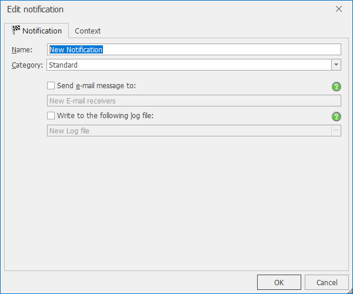
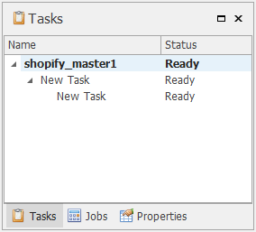
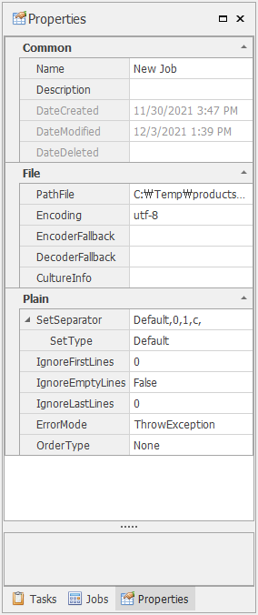
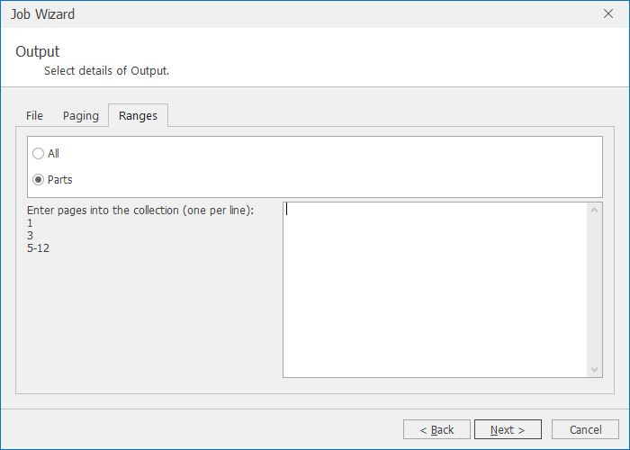
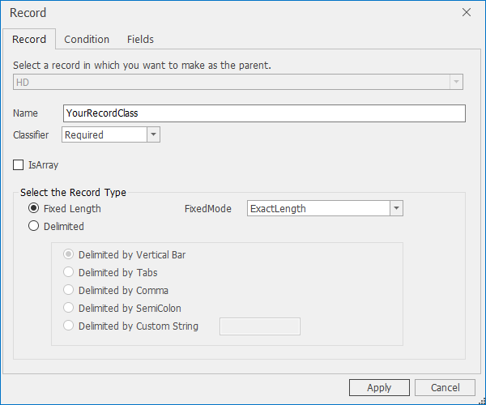
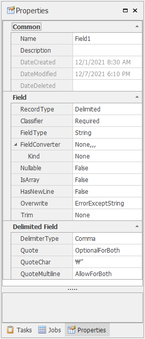
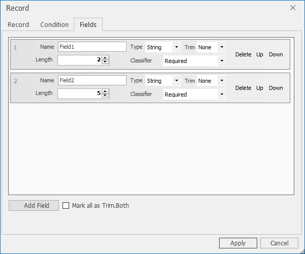

FileSheeter User’s Guide

FileSheeter 0.5:

Copyright © 2022 EazeDesign, Inc. All rights reserved.

Table of Contents

[1. FileSheeter](#filesheeter)

[1.1. Overview](#overview)

[1.2. Functions](#functions)

[1.3. Requirements](#requirements)

[2. User Interface](#user-interface)

[2.1. File Menu](#file-menu)

[2.2. Ribbon Menu](#ribbon-menu)

[2.2.1. Edit Tab](#edit-tab)

[2.2.2. Task tab](#task-tab)

[2.2.3. Parameters Popup Window](#parameters-popup-window)

[2.2.4. Notifications Popup Window](#notifications-popup-window)

[2.2.5. Macros Popup Window](#macros-popup-window)

[2.2.6. View tab](#view-tab)

[2.2.7. Settings Popup Window](#settings-popup-window)

[2.2.8. Info Popup Window](#info-popup-window)

[2.3. SideBar](#sidebar)

[2.3.1. Tasks Pane](#tasks-pane)

[2.3.2. Project Popup Window](#project-popup-window)

[2.3.3. Task Popup Window](#task-popup-window)

[2.3.4. Task Properties](#task-properties)

[2.3.5. Jobs Pane](#jobs-pane)

[2.4. Panels](#panels)

[2.4.1. Log Pane](#log-pane)

[2.4.2. Output Pane](#output-pane)

[2.5. Status Bar](#status-bar)

[2.6. LayoutEditor](#layouteditor)

[3. Plain File Layout](#plain-file-layout)

[3.1. Overview](#overview-1)

[3.2. Record Types](#record-types)

[3.2.1. Delimited Data](#delimited-data)

[3.2.2. Fixed Length Data](#fixed-length-data)

[3.3. Data File Structures](#data-file-structures)

[3.3.1. Single Record Types](#single-record-types)

[3.3.2. Multiple Record Types](#multiple-record-types)

[3.3.3. Record Identifier](#record-identifier)

[3.4. Set Definition](#set-definition)

[4. Jobs](#jobs)

[4.1. Job Wizard Window](#job-wizard-window)

[4.2. PlainFile Jobs](#plainfile-jobs)

[4.2.1. Set Separator](#set-separator)

[4.2.2. PlainFile Job Properties](#plainfile-job-properties)

[4.2.3. Handling Large Flat Files](#handling-large-flat-files)

[4.3. Output](#output)

[4.3.1. Page Separator](#page-separator)

[4.3.2. Relationships between flat file record types](#relationships-between-flat-file-record-types)

[4.3.3. Output Job Properties](#output-job-properties)

[4.4. Data Flow](#data-flow)

[4.5. Sort](#sort)

[4.6. Filter](#filter)

[4.7. LeftJoin](#leftjoin)

[4.8. Appending](#appending)

[4.9. Group](#group)

[5. Defining the Layout Structure](#defining-the-layout-structure)

[5.1. Creating Plain File Layouts](#creating-plain-file-layouts)

[5.2. Record Popup Window](#record-popup-window)

[5.2.1. Specifying a Record Identifier using Record Selector](#specifying-a-record-identifier-using-record-selector)

[5.2.2. Specifying Optional Fields](#specifying-optional-fields)

[5.2.3. Record Properties](#record-properties)

[5.2.4. Record Properties for Output Jobs](#record-properties-for-output-jobs)

[5.2.5. Field Properties](#field-properties)

[5.2.6. Field Properties for Output Jobs](#field-properties-for-output-jobs)

[6. Expression Editor](#expression-editor)

[6.1. Syntax](#syntax)

[6.2. Expression definitions](#expression-definitions)

[6.2.1. Calculation definition](#calculation-definition)

[6.2.2. Filter definition](#filter-definition)

[6.2.3. Decision definition](#decision-definition)

[6.3. Parameters](#parameters)

[6.4. Functions](#functions-1)

[7. Appendix](#appendix)

[7.1. Criteria Language Syntax](#criteria-language-syntax)

[7.1.1. Constant](#constant)

[7.1.2. Operators](#operators)

[7.1.3. Aggregate Functions](#aggregate-functions)

[7.1.4. Date-time Functions](#date-time-functions)

[7.1.5. Logical Functions](#logical-functions)

[7.1.6. Math Functions](#math-functions)

[7.1.7. String Functions](#string-functions)

[7.1.8. Operator Precedence](#operator-precedence)

[7.1.9. Format string](#format-string)

[7.1.10. MBCS String Functions](#mbcs-string-functions)

[7.1.11. Verify Functions](#verify-functions)

[7.1.12. Constants](#constants)

[7.1.13. PathFile](#pathfile)

[7.2. Expression Function Format Example](#expression-function-format-example)

[7.2.1. int 예제](#int-예제)

[7.2.2. double 예제](#double-예제)

[7.2.3. DateTime 예제](#datetime-예제)

[7.2.4. 정렬](#정렬)

[7.3. Q / A](#q--a)

# FileSheeter

## Overview

Data Manipulation Software

Flat files (including spreadsheets) are great for quick data entry by users, manipulating numerical data for fast analysis, and having rich formatting features and mathematical functions for small to moderate data sets.

FileSheeter provides logical file manipulation for files. You can view and edit or otherwise process flat file types of data and can respond efficiently to files for businesses that need to be created, increased, modified, and changed constantly. As a result, it reduces lead time for file processing and optimizes maintenance costs.

Easy UI to edit a big file (also CJK characters) using FileHelpers, NPOI.

Just click to edit a transaction file that consists of records. FileSheeter is the data migration tool that has the performance and simplicity of its large volume data definition and reformatting. The formula helps handle more complex business rules. UI supports editing metadata and formula that can modify files.

Executing jobs with an embedded rule engine

Users define jobs in GUI to transform and convert. Jobs (converts, refines Transformation) are executed by a rule engine. Jobs are easy to create, modify, share, and recycle with metadata. Jobs extract data from various flat files, process (converts, refines Transformation), and load them into new flat files.

## Functions

FileSheeter provides an interactive environment in which to create your application and represents how the application will manipulate your file.

In addition to the GUI, FileSheeter provides:

• Edit a project of FileSheeter Application.

• LayoutEditor features to simplify creating or modifying your template of a file.

• Full support for managing the FileSheeter’s options.

• Preview data of a file.

• Export a new file of data.

FileSheeter is a utility for converting files into different formats, and/or translating field[^1]-level data into other types.

[^1]: https://en.wikipedia.org/wiki/Column_(database)

    The word 'field' is normally used interchangeably with 'column'.[5] However, database perfectionists tend to favor using 'field' to signify a specific cell of a given row.[citation needed] This is to enable accuracy in communicating with other developers. Columns (really column names) being referred to as field names (common for each row/record in the table). Then a field refers to a single storage location in a specific record (like a cell) to store one value (the field value). The terms record and field come from the more practical field of database usage and traditional DBMS system usage (This was linked into business like terms used in manual databases e.g. filing cabinet storage with records for each customer). The terms row and column come from the more theoretical study of relational theory.

FileSheeter is a quick and easy way to:

data integration with various files (Flat, CSV, Excel)

reorganize very Large transaction file (2GB moreover)

record selector that identifies records conditionally

Design multiple record layouts in one or more files

Transform between plain and personalized data.

Select, join, sort, aggregate, calculate, convert, and re-format

Translate EBCDIC to ASCII fields, MBCS(like CJK) to Unicode, etc.

Remap field sizes and offsets

Reformat files by changing their field layouts from fixed length to delimited (or vice versa)

Only use certain fields on the output

Create multiple output files, and formats, from a single input format

Also, supports select, join, sort, aggregate, calculate, convert, and re-format.

Select via record selector that conditional include also predefined condition

Sort multiple numbers of keys in fields, custom sort, 2GB over within available memory

Join match syntax 1-1, n-1, inner & outer like SQL.

Append Place other records below a record

Convert translate input field data types to new types

Aggregate min, max, average, sum, count (collection only)

Calculate across rows to perform math (+ mbcs functions)

Re-map change field positions, sizes, and values

Report paging, multiple output formats

## Requirements

The runtime environment is Windows 10 64bit x64

Enough free memory on a running system should be 4 times greater than the size of an input file.

recommend highly CPU is 64bit 2GHz and ram is over 16g.,

Net Framework requirements

net framework 4.6.1 or above required

# User Interface

FileSheeter provides GUI tools used to create, view, and modify FileSheeter applications.

It contains information about how those functions relate to the FileSheeter Designer program. The FileSheeter Designer window consists of these basic components:

Title Bar, File Menu, Ribbon Menu, LayoutEditor, Side Bar (Tasks Pane, Jobs Pane, Properties Pane), Panels (Log Pane, Output Pane), Status Bar.

UI provides an environment called a Workspace in which you can design and configure your integration projects. The Sidebar is the area next to the Workspace where multiple tabs contain components that you use to build an integration project;

The title bar Displays the name of the open project and active definition.

Job name - Project name - Product name and version, File name, including path

## File Menu

The File Menu provides these functions:

**-New Project**:

This command allows you to create a new FileSheeter application.

\-**Open Project**

This command allows you to open an existing FileSheeter application.

The extension of a project is xfs.

\-**Save Project**:

This command allows you to save the changes made to the current context of the existing project

application.

\-**SaveAs Project**:

This command allows you to save the currently active file using a new name. When you select this command, the Save As window displays, allowing you to specify the directory and file name to use for the new file.

\-**Close Project**:

This command allows you to close an open FileSheeter application. FileSheeter automatically closes the open application if you do not close it before opening another application or template. You will be prompted if changes to your application have not been saved.

\-**Setting**:

This command displays the Configuration Window that you set paths or default values.

\-**Recent Projects**:

This command displays the last four files that you loaded on the FileSheeter. Use File \> Recent Files to select and reload one of the listed files.

\-**Exit**:

This command allows you to exit the FileSheeter. When there are unsaved changes in an

open the FileSheeter application you will be prompted to save them.

v

## Ribbon Menu

### Edit Tab

The Edit Tab provides these functions:

**Record Group**

This command allows you to add or insert a record definition as a sibling or child on the LayoutEditor

**Field Group**

This command allows you to add or insert a field definition on the LayoutEditor

**Move Group**

This command allows you to move a selected element on the LayoutEditor

**Find Group**

\-Find: Show Find panel.

This command allows you to search for all occurrences of a text string.

Narrow your search criteria by enabling the option.

Once you select Edit \> Find, FileSheeter locates the specified string. When a matching string is found, FileSheeter highlights the found string.

\-Option: Show the Options panel.

**FindCondition**

Select one of the following types. Contains, StartsWith, Like, Equals(default).

\-**Replace**:

Enabled if Output jobs are modified on the LayoutEditor.

**Clipboard Group**

\-Delete[^2]: This command allows you to delete selected element on the LayoutEditor.

[^2]: Deleting Definitions

    Deleting a definition is different than removing a definition from a project. When you remove a definition from a project, the reference to the definition is removed from the project, but the definition still exists in the database and thus may be a part of any other project. Deleting a definition, however, permanently removes the definition from the database. Any projects or other definitions that contains the deleted definition are affected.

    Before deleting a definition, you should find all references to that definition by running Find Definition References. For example, a field definition you want to delete may be referenced by both record and page definitions.

    including all expression.

Cut

This command allows you to delete a selected element on the LayoutEditor after executing the Paste command. The element selected by the Cut command is stored on the Clipboard.

Cut is available within the same plain file layout of the PlainFile jobs on the LayoutEditor

Copy

This command allows you to copy the selected element on the LayoutEditor. The element selected by the Copy command is stored on the Clipboard.

Copy is available among several plain file layout of the PlainFile jobs.

Paste

This command allows you to paste the element of the Clipboard at the selected position on the LayoutEditor.

**Tree Group**

\-Full Expand: Expand all elements on the LayoutEditor.

\-Full Collapse: Collapse all elements on the LayoutEditor.

### Task tab

The Task Tab provides these functions:

**Task Group**

\-Project: Display the project window. Only Task Tab on the Side Bar.

\-Add, Delete, Edit

Manage task definitions.

**Jobs Group**

Add Job definitions like Plain, Excel, Output, etc.

**Preview Group**

\-Preview:

Validate and build the project.

\-Start:

Execute the selected top node below the project node in the Tasks pane on the SideBar

\-Stop:

Cancel running jobs.

**Navigator Group**

\-Refresh:

Reload the data of the current set.

\-First, Prev, Next, Last:

Move the current set in the dataset.

**Options Group**

\-Parameters:

Display Parameters Window to manage parameter definitions used for Output jobs.

\-Notifications:

Display Notifications Window to manage notification definitions used for tasks.

\-Macros:

Display Macro Window to browse macros used for notification definitions.

### Parameters Popup Window

Global parameters are variables that can be created by the user and exist in the runtime.

This means that no one can access Global parameters that have been set by the user except Output, and when the runtime is closed these parameters expire. However, these parameters can be shared between several fields and the runtime within the Output job.

Parameters provide temporary storage locations to hold the input and output data of Jobs.

They are used to store values or intermediate results obtained at some point in program processing for additional processing or display.

\-New: Add a new Parameter.

\-Edit: Display Edit Parameter Window.

\-Delete: Delete the Parameter.

### Notifications Popup Window

Each task can be configured to generate notifications upon successful finish and/or when finished with errors. Notifications can be sent to any of the following targets:

By e-mail to one or multiple receivers.

A log file.

Each notification can be configured to be sent to multiple targets simultaneously with configurable notification texts.

\-New: Add a new Notification.

\-Edit: Display Edit Notification Window.

\-Delete: Delete the Notification.

Notifications enable you to configure whether/how the successful/erroneous exit of a task will be notified. You define notifications in a global repository and assign them later to the actual tasks to run.

To configure E-mail/Log notification settings:

In the main ribbon, click "Notifications".

The notifications window opens. Click the "E-mail" tab page or “Log file” to show all available notification configurations.

Enter the e-mail (SMTP) server settings and the log file settings.

**E-mail Server**

The name of the outgoing mail server. The default value is localhost.

**Port**

The port number for the outgoing mail server. The default value is 25.

**TLS/SSL Implicit Port.**

It is not a default and is dependent on a mail server

**User name, Password**

The username (e-mail address) and password to authenticate for the E-mail Server.

**Domain name**

Credentials Domain is needed to authenticate for E-mail Server in case of NTLM or Kerberos.

**Sender address**

Specify one sender’s e-mail address that appears as the sender of a notification message. Use the optional format "David Lee \<David.Lee@test.com\>" to specify a display name.

**Limit log file size:**

**maximum file size**

Specify the maximum size of the log.

**Keep up to…previous files**

Specify the maximum number of files to be logged.

The New command displays the Edit notification Window.

To define a notification:

In the main ribbon, click "Notifications".

The notifications window opens. Click the "New" button to add a new notification.

Enter a name for the notification to identify it later.

Configure which notifications will be sent out to which destinations.

Configure the notification texts that will be sent out.

**Send e-mail messages to:**

The email address(es) or mailing list(s) that receive the notification. Use a comma or a semi-colon to separate multiple email addresses.

Specify one or multiple e-mail addresses that receive the specified notification message.

Use the optional format "David Lee \<David.Lee@test.com\>" to specify a display name.

Separate multiple addresses by a comma (","). You can’t use macros.

**Write to the following log file:**

Specify a full path (folder name and file name) for the log file to write the notification to.

If you specify a path on a local drive (e.g. "C:\\log.txt"), The log file will be written on the computer that is executing the task. If you don't have permission to write, Notifications may not work.

You can use macros.

**Subject**

The text that appears in the email subject line.

**Message**

The text appears in the body of the email. To type in or paste text, select Value at the bottom of the Activity panel. The Editor does not limit you on the amount of text you can enter

### Macros Popup Window

For most settings (like job definitions or notification settings), you can use macros that are expanded during runtime. This enables you to minimize the hardcoding of information, making the application easily transferable to other systems.

Some example macros among the more than 20 macros include:

It is that Environmental information like computer name, environment variables, current date or time, program path, Project information like current Project file and folder path, Task information like name or last result, and Job information like ID or user name.

### View tab

The View Tab provides these functions:

**Views Group**

\-Tasks: Select the Tasks pane on the Sidebar.

\-Jobs: Select the Jobs pane on the Sidebar.

\-Properties: Select the Properties pane on the Sidebar.

\-Output: Select the Output pane in the Panels.

\-Log: Select the Log pane in the Panels.

**Help Group**

Settings- Display the Configuration Window.

Info-Display the Info Window.

### Settings Popup Window

**Path Tab**

\-Application path: directory of FileSheeter

\-Application Log File: full path of the log file.

\-Project BaseDirectory: a project file will be created below the specified Directory. Path used in the Create New Project Window.

\-Use Project BaseDirectory when creating a new project: a project file will be created within the project folder.

**UI Language**

**CSharp Keywords**

This lists the reserved words[^3] that should not be used to name records or fields in FileSheeter.

[^3]: <http://msdn.microsoft.com/en-us/library/x53a06bb.aspx>

**Reserved Keywords Tab**

This lists the reserved words that should not be used to name records or fields in FileSheeter.

**Encoding Tab**

Specify default character Codepage in a Project. Choose at least one.

**CultureInfo Tab**

Specify default culture Info in a Project. Choose at least one.

### Info Popup Window

When you use a job that requires a license, use it to register the license string. Jobs that requires a license are Join, Sort, Filter, and Appending excluding PlainFile, ExcelFile, and Output.

## SideBar

Provides a graphical representation of the components contained in a project. The SideBar has three panes:

### Tasks Pane

A task is a unit of execution, which means a task will execute its job.

Tasks Pane shows a hierarchical structure of all tasks using a tree layout.

Tasks of a project are executed by the engine, which determines which tasks must be executed in order. The executing order of tasks is determined by depth-first search.

A project is defined and created using FileSheeter. The project has properties and several additional metadata that comprise all elements - tasks, jobs, parameters, Plain Files - and their specific configuration.

**Define tasks**

After you have defined your jobs which serve as the base for the tasks, you can start adding tasks.

Since tasks can be added either to Project as root tasks or to other tasks as child tasks, it is important which element you select in a tree list of the Tasks pane.

**Adding top tasks to Project**

To add a top task to a Project, perform the following steps:

1\. Select the project in the Tasks Pane by left-clicking it.

2\. In the Task Group on the ribbon, click "Add".

3\. Display the Task Popup Window. Give the task a name to identify it later.

4\. Select a predefined job from the list. This job is executed for the task. If you want to add a new job, click “Add” in the "Jobs" Pane on the sidebar in advance.

5\. Optionally configure notifications to be sent out upon successful or erroneous exit of the program to run.

Repeat the above steps for all the top tasks you want to add.

**Add child tasks to tasks**

To add a child task to an existing task, follow these steps:

1\. Select the task in the Tasks Pane by left-clicking it.

2\. In the Task Group on the ribbon, "Add".

3\. Display the Task Popup Window. Give the task a name to identify it later.

4\. Select a predefined job from the list. This job is executed for the conditions you configure in the task. If you want to add a new job, click “Add” in the "Jobs" pane on the sidebar in advance.

5\. Optionally configure notifications to be sent out upon successful or erroneous exit of the program to run.

Repeat the above steps for all child tasks you want to add. Please note that you can nest tasks indefinitely.

\-Edit Project: Display Project Popup Window.

\-Add Task: Display Task Popup Window.

\-Edit Task: Display Task Popup Window.

\-Delete Task: Delete a Task that doesn’t have a job.

\-Preview task and child tasks now:

If the selected node is a direct child node of the project node, it is enabled. The direct child nodes of the project node are tasks. The top task and children will be executed.

### Project Popup Window

FileSheeter can create, edit and execute a project that supports the definition of metadata, and the independence of data from applications.

The project is as job specification files and describes the file type and field layout of your input and output files. It has 'xfs' extensions.

Through the use of metadata repositories -- Project – you can define and share any structured dataset in FileSheeter. Those file layouts can be re-used in another FileSheeter.

Basic Tab

\-**Location**: The path of a project file.

\-**Name**: The filename of a project file without extensions.

\-**Description**:

Optionally enter remarks

\-**Tasks on the host are active**:

Enables the Preview and Start command in the Preview group of the Task tab in the Ribbon menu.

**Engine Tab**

**-Max Sets for Preview:** Available numbers of sets to preview.

Jobs only process the specified number of sets of a file for previewing. If the sample file contains more than 10 sets, skip the remainder of the lines so that the total set count stays within the 10 set limit.

\-**Max Pages in a Sheet:**

Maximum pages in a sheet of the set

\-**Max Sheets in a Subset:**

Maximum sheets in a subset of the set

**Maximum Pages in a Subset = Maximum Pages in a Sheet \* Maximum Sheets in a Subset**

Both the maximum page in a sheet and maximum sheets in a subset affect Parameters related to the File, Subfile, Set, and Subset Category. It is used to evaluate expressions with parameters.

It is used to calculate the maximum pages in a subset automatically while executing Output. If the number of pages in a subset exceeds the maximum pages in a subset, a set will contain one more subset. For more details, Refer to Output Job.

**OutputTypePreview**

Select the kind of a set (collection of records) shown in the Output pane in the Panels.

Project in Properties Pane

IsActive

It will be treated in the same manner as Tasks on the host are active.

OutputTypePreview

### Task Popup Window

A Task is a functional unit of processing within a project. The Project contains a series of tasks.

Task Tab

**-Path**

\-**Name**: The filename of a project file.

**-Description**

Optionally enter remarks

Properties Tab

**-Dependent task Group**

A task can depend on another task or not. A dependent task cannot be started until the parent task is complete.

The dependent tasks can be executed after the specified minutes.

You can specify the kind of the result of a predecessor to execute a successor.

Select one of the following types.

Successfully, With error, both Successfully or with error

The Task can use Notifications listed in control. The selected Notification is used in sending the specified string after the execution.

After executing the Preview or Start command, the results of jobs are listed.

### Task Properties

### Jobs Pane

A job refers to a unit of work, which means a job will process the data.

The concept of a "job" contains all the definitions of an actual task to be executed. A job is contained in a Project, allowing to exclusively assign one job to a task thus simplifying the creation and assignment of tasks.

A job is selected exclusively for only one task, which when performed, signifies the execution of a job.

The Sidebar pane displays next to the LayoutEditor.

Defining and manipulations for data have kinds of types

\-File(Plain, Excel, Output...),

\-Sort, Join, Filter, Process, Log, etc.

A job contains the following major settings and properties of each job

Name and category - Helps in categorizing and quickly finding jobs.

\-Add: Display the Job Wizard window.

\-Edit: Display the Job Wizard window if the job is selected and activated by a task.

\-Delete: Delete the Job if the job is unselected and deactivated by a task.

During run time, the input data of each Child Job expects object data of the parent job. The input data contain a collection of sets. Also, each set consists of a collection that has different record types.

## Panels

### Log Pane

View errors that you receive when you're in the preview or running through LayoutEditor. View messages related to project operations, like opening a project or inserting definitions into the project. Errors, warnings, and informational messages appear here.

### Output Pane

View the data of the LayoutEditor.

## Status Bar

Note some information.

## LayoutEditor

The LayoutEditor is an interactive facility that allows you to add, edit, or preview elements, attributes, and values in your jobs. The commands of the Edit Tab in RibbonMenu are context-sensitive and allow access to all the elements and functions available on the LayoutEditor.

A Plain File layout is a metadata that describes the format and structure of Flat File data processed by FileSheeter. When you create a Plain File layout, a corresponding internal FileHelpers-based representation of the metadata is also generated.

During run time, FileSheeter uses the Plain File layout for the following actions:

Parse incoming Flat File data (valid to the Plain File layout) and convert it to object data. This parsing is done in the PlainFile Job. The converted object data is valid to the internal FileHelpers-based representation generated from the Plain File layout.

Convert object data into outgoing Flat File data valid to a Plain File layout. This conversion is done in the Output job.

After running the Preview or Start command of the Task tab in the Ribbon Menu, the result data displays on the LayoutEditor.

Use the Plain File LayoutEditor to create Plain File layouts which describe the following types of elements:

A record definition is an element that is defined in the plain file layout.

A record reference is an element that is replicated from the plain file layout of the parent task.

# Plain File Layout

Flat files present certain hierarchical structural data in a record–based storage format. Flat files do not embed structural information (metadata) within the data. The data in the flat file has been “flattened” by removing the hierarchical relationship between records. All flat files consist of a list of records containing fields: Fields[^4] are pieces of data. Records are sequences of fields.

[^4]: 

Before using flat files, you must create a plain file layout that contains a particular flat file’s structural information, including how to identify records and separate those records into fields. The plain file layout enables users of flat files to parse and validate flat files.

## Overview

A Plain File layout defines the parsing rules, constraints, and structure of a Flat File. Flat Files are any text data, such as comma or tab delimited files and specific formats. In addition to supporting fixed-length records and fields.

In FileSheeter using the Plain File Layout Editor, you can create definitions for the structure of flat files and sets. The metadata for the data details the structure of the data, including delimiters, records, and repeated record structures. A plain file layout also acts as the model against which you can validate a flat file.

A plain file layout consists of hierarchical elements that represent each record, and field in a flat file. Each element is a record or a field. Additionally, each element is either a reference or a definition. You configure each element with the necessary constraints. Plain file layouts contain information about the constraints in the job, record, and field levels of flat files.

A plain file layout can define three types of constraints:

Structural constraints describe the sequence of records and fields in a flat file. You define structural constraints for each parent element (an element that contains other records or fields) in the plain file layout.

Content type constraints describe the possible values or minimum/maximum values for elements in a flat file. For example, the field specified as an integer type might have a content constraint specifying that its value must be all digits. These types of constraints are referred to as validators.

Conditional constraints describe the valid combinations of fields allowed in records. For example, you can use the Required (R) conditional validator to require that at least the first one of the specified fields be present.

To parse a flat file, use the PlainFile Job specified in a Task. The PlainFile Job has a plain file layout consisting of record definitions and uses record definitions (Delimited or Fixed Length) to parse the records in a flat file.

After each record in a flat file has been read, each record must be identified. This is done using all of the Record Selectors. Identifying the record defines that record, as defined in the plain file layout. The field values then are pulled from the record using the record definitions defined in the plain file layout. If the record cannot be identified, the field values are not extracted from the record.

Finally, the parsed record is placed in the data based on the structure defined in the plain file layout. This process is repeated until all records in the flat file have been parsed.

## Record Types

Parsing a record breaks a flat file into individual records. When defining a plain file layout, you can specify one of the following record types:

Delimited Record.

This expects a specific delimiter to indicate a field. For a field delimiter, you can specify a character.

The occurrence of the field delimiter signals the end of one field and the beginning of the next field.

Fixed Length Record.

This splits a file into records of the same prespecified length.

Note: This measures the lengths and positions of records in terms of bytes, rather than characters. This does not affect users who parse/compose flat files using single-byte encodings because one byte equals one character. There is no functional difference between specifying bytes or characters. The parser supports both single-byte and multi-byte encodings. You should specify the number of bytes a character when a file is multi-byte encodings.

### Delimited Data

A Plain File layout can describe data that is defined using delimiters, for example: by delimited values or by comma-separated values (CSV). A CSV file containing delimited data is shown in the following example:

**↵** is a line separator. Like CRLF, LF.

**↵** 01 1st Record of the 1st Set

**↵**   02 2nd Record of the 1st Set.

**↵** 03 3rd Record of the 1st Set.

**↵** 04 4th Record of the 1st Set.

**↵** 05 5th Record of the 1st Set.

The fields of the record are delimited by a separator. In Example, the separator is ;(Semicolon). The records of the file are delimited by the end of the line. In Example, Carriage Return. For example, The Plain File Layout parses delimited fields and contains repeating records.

Delimited data is a collection of fields with variable lengths. Delimiters are used to signal the beginning or end of the field as shown in the previous example: The example of delimited data where individual fields of the record are delimited by Semicolons (HD, HD2, LD1, LD2, LD3, LD4, LD5, and TD), and the records of the file are delimited by the end of the line.

### Fixed Length Data

A Plain File layout can describe fixed length data. Many applications use positional data. Fixed-length data is shown in the following example:

Field1Field2 Field3 Field4 Field5

**↵**

**↵**

**↵**

**↵**

Fixed length data are simple collections of records where each record has a known length. For example, the Field1 could contain the characters found between the 0 and the 1 character positions, the Field2 could contain the characters found between the 2 and the 6 character positions, as shown in the example:

Fixed Length Data example where a limited number of characters is allocated to each field, in this example: Field1, Field2, Field3, Field4, and Field5.

For this example, the end-of-line delimiter is used to separate the data in the first and second records.

All data in the record is required because omitting the data would change the position of subsequent fields. If data is not available, spaces or zeros are added to pad out the field lengths as shown for the Field2 and Field3 fields in the previous example.

In the first line of data in the previous example, no data is specified for the Field3 field - instead, there are spaces to pad out the missing Field3, so the string: 0001002003004 is correctly parsed as the Field4.

Fields can repeat, but the number of occurrences must be predefined in the properties of the field and each record must have the same number of fields.

For example, if you specified that the number of occurrences of the Field4 field was equal to six, each record in the field must specify six strings of length 5 or add spaces to pad for the missing data as shown in the previous example. Because the length of the record equals the sum of each field length, the field length implicitly sets the length of an overflow record.

Overflow records are data that are too more or less to fit on the specified record because of their length, and should are specified with FixedMode indicates the behavior when the length of records is more or less.

## Data File Structures

There are two basic types of data file structures: Those that contain single-record sets, or those that contain multiple-record sets. The following is a brief description of these two types.

### Single Record Types

In a single-record data file, each line of data from the data file equates to a distinct set. This means there is no relationship between records in the data file—each record stands on its own and is distinct from another.

One usage for a single-record set would be a product list. In this scenario, a single record would be created based on the product. The product identification number could serve as the set identification. A data file produced from this type is known as a flat data file. Example:

Field1Field2 Field3 Field4 Field5

**↵**

**↵**

Field1 refers to product identification. The rest of the fields describe the individual data items for each specific record.

Note: You can only import records with one record type per import. If your file contains records associated with different record types, modify the file to separate it into a separate file per record type, and be sure to select the appropriate record type during import. Otherwise, you use multiple record types.

### Multiple Record Types

In a multiple-record data file, several lines of data (and therefore several records) from the data file equate to one set. This means there is a relationship between records in the data file and information identifying them as such set Ids will be needed.

For example, in a typical product and parts details, a set might consist of the following records:

\- one product record

\- multiple (zero or more) parts records

For a given set there would be one or more parts records for one product record, dependent on the number of parts in the product. However, if you allowed a product without parts, then those sets would not have any corresponding parts record.

A set designed for a product and parts details might consist of the following records:

Records are defined as HD record of which Classifier is equal to Required and IsArray is false, LD record of which Classifier is equal to Required and IsArray is true, and TD record of which Classifier is equal to Required and IsArray is false. The set definition contains three records where HD, LD, and TD.

A sample file structure could be as follows (not all fields are defined for this example):

**↵** 01 1st Record of the 1st Set.

**↵** 02 2nd Record of the 1st Set.

**↵** 03 3rd Record of the 1st Set.

**↵** 04 4th Record of the 1st Set.

**↵** 05 5th Record of the 1st Set.

**↵**  06 6th Record of the 1st Set.

**↵** 07 1st Record of the 2nd Set.

**↵** 08 2nd Record of the 2nd Set.

**↵** 09 3rd Record of the 2nd Set.

**↵** 10 4th Record of the 2nd Set.

**↵** 11 5th Record of the 2nd Set.

**↵** 12 6th Record of the 2nd Set.

**↵** 13 7th Record of the 2nd Set.

**↵** 14 1st Record of the 3rd Set.

**↵** 15 2nd Record of the 3rd Set.

**↵** 16 3rd Record of the 3rd Set.

**↵** 17 4th Record of the 3rd Set.

**↵** 18 5th Record of the 3rd Set.

**↵** 19 6th Record of the 3rd Set.

**↵** 20 1st Record of the 4th Set.

**↵** 21 2nd Record of the 4th Set.

**↵** 22 3rd Record of the 4th Set.

**↵** 23 4th Record of the 4th Set.

**↵** 24 5th Record of the 4th Set.

**↵** 25 6th Record of the 4th Set.

You can model file-based data structures that contain different types of records within the same file by using a single plain file layout with multiple record types.

For example, A file that we received for processing may have several types of records. The size of these records can be different. To enable multiple record types, we need to use more than one record definition in the Plain File layout. As record definitions of the input begin with top level entry, we will have to provide a top level for each of the record types. When a file contains multiple record types, a record definition must be created for each type of record.

Even though we have defined multiple record types, there should be a way for the program to know what types of record it has just read and how it needs to be processed. One way of doing this is to get this info by looking at the characteristics of the data.

Hence to provide the type of the record of the Plain File Layout should use the Record Selector to determine the type of the record.

All record types in the plain file layout are valid in the global scope of the project and can be used between jobs.

### Record Identifier

Records can also have identifying codes, known as either records alias or index. For example, each record either begins with a record ID[^5] or contains a record ID and ends with a delimiter.

[^5]: Identifier

FileSheeter allows each Record Selector of record definitions to connect their record definition in a plain file layout with a line in the flat file. The Record Selector looks at each line in a file and finds an identifier out of the data. The record definition converts from a line in the flat file to a record when the value obtained by the criteria of the Record Selector equals true.

After creating record definitions, you should choose from one of several methods of record identification.

## Set Definition

A file is a collection of data records with multiple record types, A file can be considered to be a group of physical records; it can also be considered to be a group of logical records. A physical record is a unit of data that is treated as a line when moved into or out of a file. The size of a physical record is determined by the line separator.

A logical record is a unit of data which have a logical relationship. A logical record may itself be a physical record (that is, be contained completely within one physical unit of data); one logical record may extend across several physical records.[^6]

[^6]: Logical record could be a collection. In case of NewLine Properties

A set is a collection of logical records determined by criteria identified by a relationship between records as a subdivision of logical records in a file. Sets can contain numerous records of several types within the available memory. A Set is a unit of data that is treated as a container when data is moved between the parent’s job and the child’s job. FileSheeter uses sets to contain logical records, which are used by jobs either to read data from a file or to present data to the output.

The following example data shows the structure of a repeating set of records that can be defined using a set definition: A Set is delimited by the first record at the beginning of repeating records.

Records are defined as HD record of which Classifier is equal to Required and IsArray is false, LD record of which Classifier is equal to Required and IsArray is true, and TD record of which Classifier is equal to Required and IsArray is false. The set definition contains three records where HD, LD, and TD.

**↵** 01 1st Record of the 1st Set.

**↵** 02 2nd Record of the 1st Set.

**↵** 03 3rd Record of the 1st Set.

**↵** 04 4th Record of the 1st Set.

**↵** 05 5th Record of the 1st Set.

**↵**  06 6th Record of the 1st Set.

**↵** 07 1st Record of the 2nd Set.

**↵** 08 2nd Record of the 2nd Set.

**↵** 09 3rd Record of the 2nd Set.

**↵** 10 4th Record of the 2nd Set.

**↵** 11 5th Record of the 2nd Set.

**↵** 12 6th Record of the 2nd Set.

**↵** 13 7th Record of the 2nd Set.

**↵** 14 1st Record of the 3rd Set.

**↵** 15 2nd Record of the 3rd Set.

**↵** 16 3rd Record of the 3rd Set.

**↵** 17 4th Record of the 3rd Set.

**↵** 18 5th Record of the 3rd Set.

**↵** 19 6th Record of the 3rd Set.

**↵** 20 1st Record of the 4th Set.

**↵** 21 2nd Record of the 4th Set.

**↵** 22 3rd Record of the 4th Set.

**↵** 23 4th Record of the 4th Set.

**↵** 24 5th Record of the 4th Set.

**↵** 25 6th Record of the 4th Set.

Set definitions allow you to define repeated occurrences of sets of logical records. when the data does not provide any additional delimiters or structure, the Set Separator of the PlainFile Job is required to mark the beginning and end of repetitions that contain more than one record. All logical records identified by record definitions need to be divided into logical sets by the set separator.

# Jobs

A job performs each particular operation in FileSheeter and is organized into categories on the Jobs tab

There are two kinds of jobs according to the way of creating the plain file layout.

Following jobs should create a new plain file layout: PlainFile, ExcelFile.

Following jobs be referenced from an existing plain file layout: Join, Appending, Sort, Filter, Group

**CUSTOMER Record**

| ID | FIRSTNAME | LASTNAME  |
|----|-----------|-----------|
| 1  | Paul      | Lee       |
| 2  | David     | Jones     |
| 3  | Lucas     | Smith     |
| 4  | Sophia    | Davis     |

**CUSTOMER_DETAIL Record**

| ID | PRODUCT | PRICE |
|----|---------|-------|
| 1  | A       | 10    |
| 2  | B       | 20    |
| 3  | C       | 10    |
| 1  | D       | 20    |
| 2  | E       | 30    |
| 3  | F       | 50    |

## Job Wizard Window

Click Add command of the Context Menu, which appears when you right-click on the Jobs Pane of the SideBar. If there are no jobs on the Jobs pane, click one of the commands of the Jobs Ribbon Group after selecting the Task tab in the Ribbon Menu.

Using Jobs in the Job Wizard, you can identify all types of flat files and process certain types of flat files. You create plain file layouts both to convert flat files and to write to the output.

Type Tab in Job Page

Select the type of a job, and Click Next.

Basic Tab in Common Page

\-Name: Default is ‘New Job’. Used as an alias and can be duplicated.

\-Category: Default is Standard

\-Description: Optionally enter remarks

## PlainFile Jobs

The Job Wizard creates the PlainFile job including a layout that defines the format of a flat file based on sample data. The PlainFile job uses this layout to convert flat files into a record collection. The plain file layout of PlainFile jobs is referred to directly.

To process a flat file, use a PlainFile job. This job uses a plain file layout to parse flat files into records. The input of this job is a flat file, and the output of this job is a dataset. A dataset consists of a collection of sets. The output is created based on the structure defined in the plain file layout. You can also validate the flat file against the plain file layout. During validation, the constraints placed on the records and fields cause the plain file layout to generate errors as output.

The plain file layout provides the PlainFile job with the information necessary to detect the specified delimiter and length of both records and fields. After a record delimiter is detected, the job matches the record in the flat file with a record defined in the plain file layout using the record identifier.

The Plain File job converts the flat file into a dataset by applying the specified Plain File Layout. The dataset is passed from this job to the next job as the output parameter. The input parameter of the Plain File Job expects Flat file data. Flat file data includes comma-separated values (.csv) and other types of delimited files, as well as fixed-length text files.

Before you can select a job in the Task Popup Window, you must create the Plain File layout on the LayoutEditor of the job. Define the records, fields, and sets in the Plain File layout for your Flat File.

File Tab in Input Page

In the case of PlainFile

**FilePath**

Select a flat file or sample data to be read.

**Encoding[^7]**:

[^7]: Encoding is the process of transforming a set of Unicode characters into a sequence of bytes. In contrast, decoding is the process of transforming a sequence of encoded bytes into a set of Unicode characters.

Specify the encoding type that should be used to encode the data

**DecoderFallback**

Provides a failure-handling mechanism, called a fallback, for an encoded input byte sequence that cannot be converted to an output character.

**Encoderfallback**

Not available.

Provides a failure-handling mechanism, called a fallback, for an input character that cannot be converted to an encoded output byte sequence.

**-CultureInfo**

Provides parsing for culture-specific operations, such as casing, formatting dates, numbers, and comparing strings.

**-Ignore First Line**:

Indicates the number of lines at the beginning to be ignored of the file.

**-Ignore Last Line**:

Indicates the number of lines to be ignored at the end of the file.

**-Ignore Empty Lines**:

Indicate if blank lines are to be ignored in the file.

\-**Error Mode:**

Indicates the behavior when the engine found an error. Select one of the following types.

ThrowException :

The default value, this simply Rethrow the original exception.

SaveAndContinue :.

Add an Error to the array of Errors. Then continue.

IgnoreAndContinue :

Simply ignores the exception and continues

\-**Order Type**:

Indicates how the records are arranged within a set while reading a file. Select one of the following types.

None is the default.

Sorted

The records are arranged by the order of records in a plain file layout.

In the case of ExcelFile

**Sheet**

The sheet name is in the specified excel.

**StartRow**

The row of the first data cell. Start from 0.

**StartColumn**

The column of the first data cell. Start from 0.

**Header Rows**

The number of header lines

\-Grouping Tab in Input Page

**Set Separator**

Indicate how to start a new set based on criteria.

The Set Separator specifies criteria acted as a set delimiter. If the result returned by criteria equals true, the record on which it appears is the beginning record of a new set.

You can build criteria using a valid combination of offset, length, string, and logical expression. Criteria can be used as a condition in a Set Separator. If a certain condition is true, a record is the beginning record of a new set. The condition is evaluated record by record.

\-Set Type

Indicates the kind of criteria that determines if the current record is the beginning record of a new set.

\-Offset

The 0-based position of the reference string of this record.

\-Length

The length of the reference string of this record.

\-String

The string to be compared.

\-Expression

It should be a logical expression. In this case, an expression should return a boolean value. For more details, Refer to Expression Editor.

The logical expression to determine whether the beginning record is a Set delimiter or not.

### Set Separator

The set definition is defined using the Set Separator in the job definition, which includes definitions of the various record types. Set definitions can be specified using criteria that identify a relationship in logical records. The criteria are the statement of conditional logic that are based on either one or more variables, or one constant value using presets.

Defining a set that begins with the first record of a sequence of records with the same relationship like set Ids and ends in the previous record of another first record: The criteria for finding a series of records is called the Set Separator.

In case Set Separator has configured that SetType is equal to Contain and String is equal to HD.

**↵** 01 1st Record of the 1st Set.

**↵** 02 2nd Record of the 1st Set.

**↵** 03 3rd Record of the 1st Set.

**↵** 04 4th Record of the 1st Set.

**↵** 05 5th Record of the 1st Set.

**↵**  06 6th Record of the 1st Set.

**↵** 07 1st Record of the 2nd Set. Set Separator will return true.

**↵** 08 2nd Record of the 2nd Set.

**↵** 09 3rd Record of the 2nd Set.

**↵** 10 4th Record of the 2nd Set.

**↵** 11 5th Record of the 2nd Set.

**↵** 12 6th Record of the 2nd Set.

**↵** 13 7th Record of the 2nd Set.

**↵** 14 1st Record of the 3rd Set. Set Separator will return true.

**↵** 15 2nd Record of the 3rd Set.

**↵** 16 3rd Record of the 3rd Set.

**↵** 17 4th Record of the 3rd Set.

**↵** 18 5th Record of the 3rd Set.

**↵** 19 6th Record of the 3rd Set.

**↵** 20 1st Record of the 4th Set. Set Separator will return true.

**↵** 21 2nd Record of the 4th Set.

**↵** 22 3rd Record of the 4th Set.

**↵** 23 4th Record of the 4th Set.

**↵** 24 5th Record of the 4th Set.

**↵** 25 6th Record of the 4th Set.

You can specify the first record in a plain file layout when creating a plain file layout. The first record is used to determine the beginning record of a set when the PlainFile Job finds a match between the flat file and the plain file layout.

In case the Set Type of the Set Separator is equal to Default, PlainFile Jobs will use the first record of the plain file layout as the beginning record which leads to containing any records it does repeat into a set until another first record meet. When the occurrence of the beginning record is duplicated during parsing a file, The PlainFile Job creates a new set and contains the beginning record into a new set. PlainFile jobs contain all records into a new set before the occurrence of another beginning record.

The occurrence of the beginning record delimits the end of one set and the beginning of the next set. If the Set Separator is equal to Default, IsArray of the first record definition must be equal to false. It is similar to the header record of a transactional file.

Setting the first record:

You can move the selected record to the first record when creating a plain file layout. This record is used to compare records to find a beginning record of the set.

### PlainFile Job Properties

You display the properties of a job by selecting the job on the LayoutEditor.

The properties pane shows all properties of the selected job. The properties are grouped by category. You can collapse or expand individual categories or all categories

The job definition is used to define the selected job.

### Handling Large Flat Files

By default, FileSheeter processes all flat files in the same manner, regardless of their size. PlainFile jobs receive a flat file and keep the file content in memory during processing. However, if you receive large files, FileSheeter can encounter problems when working with these files because the system does not have enough memory to hold the entire parsed file.

If some or all of the flat files that you process encounter problems because of memory constraints, you must reduce the size of a file. Otherwise, if the results were kept in the memory, out–of–memory errors might occur.

## Output

The Job Wizard creates the Output job that has a plain file layout derived from the parent job. The Output Job uses the derived layout to convert the dataset into a flat file. The plain file layout of Output Jobs is referred to indirectly and a derived Record definition of Output Jobs is built automatically from them.

To write a flat file, use the Output job. This job uses a plain file layout to create a flat file from a dataset passed from a job of the parent task. The input of this job is the dataset passed from the parent job, and the output of this job is a flat file.

The Output Job converts the dataset passed from a job of the parent task into flat file data by applying the derived Plain File Layout. The dataset of this job is converted into a flat file. Flat file data includes comma-separated values (.csv) and other types of delimited files, as well as fixed-length text files.

The Output uses the layout to convert a collection of sets into the output one by one.

**1. File tab**

\-**Output Type:**

Select one of the following types. txt, xml.

**-Output Directory:**

Browse for a directory on your computer where you want to save the data file.

\-**Output File:**

Enter only the name for the data file.

\-**Encoding in Text.Group:**

specify the encoding type that should be used to encode the outgoing data

**DecoderFallback**

Not available.

Provides a failure-handling mechanism, called a fallback, for an encoded input byte sequence that cannot be converted to an output character.

**Encoderfallback**

Provides a failure-handling mechanism, called a fallback, for an input character that cannot be converted to an encoded output byte sequence.

\-**CultureInfo in Text.Group:**

Provides parsing for culture-specific operations, such as casing, formatting dates, numbers, and comparing strings.

\-**Override NewLength:**

Indicate the behavior that replaces the length of all fields in the job with a new length to be overridden in the case of FixedLength.

\-**Error Mode:**

Indicates how errors are raised while writing a file.

Indicates the behavior when the engine found an error.

Select one of the following types.

ThrowException :

The default value, this simply Rethrow the original exception.

SaveAndContinue :

Add an Error to the array of Errors. Then continue.

IgnoreAndContinue :

Simply ignores the exception and continues

**2. Paging tab**

Page Separator Group

Indicate how to start a new page based on criteria.

The Page Separator specifies criteria acted as a page delimiter. If the result returned by criteria equal to true, the record on which it appears is the beginning record of a new page.

You can build criteria using a valid combination of offset, length, string, and logical expression. Criteria can be used as a condition in a Page Separator. If a certain condition is true, a record is the beginning record of a new page. The condition is evaluated record by record.

**Paging Type**

Indicates the kind of criteria that determines if the current record is the beginning record of a new page.

\-**Offset**

The 0-based position of the reference string of this record.

\-**Length**

The length of the reference string of this record.

\-**String**

The string to be compared.

\-**Expression**

It should be a logical expression. In this case, an expression should return a boolean value. For more details, Refer to Expression Editor.

The logical expression to determine whether the beginning record is a page delimiter or not.

3\. Ranges Tab

Ranges Tab specifies the range of pages to print for the current job. Select one of the following types.

All, Parts.

### Page Separator

Page definitions can be specified using criteria which logical records in sets group by.

Defining a page that begins with the first record of a sequence of records to be included in a group for business rule and ends with the previous record of another first record: The criteria for finding a series of records is called the Page Separator.

In the case of Set Separator has been configured that Type is equal to Contain and String is equal to ‘HD’.

Page Separator has configured that PagingType is equal to IsType and String is equal to TD.

**↵** 01 1st Page of the 1st Set. 1st Page of the sample.

**↵** 02 1st Page of the 1st Set. 1st Page of the sample.

**↵** 03 1st Page of the 1st Set. 1st Page of the sample.

**↵** 04 1st Page of the 1st Set. 1st Page of the sample.

**↵** 05 1st Page of the 1st Set. 1st Page of the sample.

**↵**  06 2nd Page of the 1st Set. 2nd Page of the sample. Page Separator will return true.

**↵** 07 1st Page of the 2nd Set. 3rd Page of the sample. Set Separator will return true.

**↵** 08 1st Page of the 2nd Set. 3rd Page of the sample.

**↵** 09 1st Page of the 2nd Set. 3rd Page of the sample.

**↵** 10 1st Page of the 2nd Set. 3rd Page of the sample.

**↵** 11 1st Page of the 2nd Set. 3rd Page of the sample.

**↵** 12 1st Page of the 2nd Set. 3rd Page of the sample.

**↵** 13 1st Page of the 2nd Set. 3rd Page of the sample.

**↵** 14 1st Page of the 3rd Set. 4th Page of the sample. Set Separator will return true.

**↵** 15 1st Page of the 3rd Set. 4th Page of the sample.

**↵** 16 1st Page of the 3rd Set. 4th Page of the sample.

**↵** 17 1st Page of the 3rd Set. 4th Page of the sample.

**↵** 18 1st Page of the 3rd Set. 4th Page of the sample.

**↵** 19 2nd Page of the 3rd Set. 5th Page of the sample. Page Separator will return true.

**↵** 20 1st Page of the 4th Set. 6th Page of the sample. Set Separator will return true.

**↵** 21 1st Page of the 4th Set. 6th Page of the sample.

**↵** 22 1st Page of the 4th Set. 6th Page of the sample.

**↵** 23 1st Page of the 4th Set. 6th Page of the sample.

**↵** 24 1st Page of the 4th Set. 6th Page of the sample.

**↵** 25 1st Page of the 4th Set. 6th Page of the sample.

For example, the weight of each record in a set can be calculated for separating into logical pages.

In case the selected type of the Page Separator is equal to Weight, if the weight of the current record exceeds the maximum weight specified in the Page Separator, the current record can’t belong to the page and is to belong to a new page.

If the Page Separator is equal to None, Built-in parameters will be never changed in an expression during runtime. Pagination is a process that is used to divide a set into pages.

Output Jobs use pagination because of Built-in parameters in expressions and subdivisions for sets. To implement pagination, we will usually need two factors of information:

limit - Number of Maximum Pages in a Subset

Maximum Pages in a Subset = Maximum Pages in a Sheet \* Maximum Sheets in a Subset.

Maximum Pages in a Subset is a constant value.

Number of Pages – Increment the number of pages by one when Page Separator returns true.

If the number of pages in a subset exceeds the maximum number of pages in a subset, a set will contain one more subset. It increments the count of a subset in a set by one.

It allows you to paginate through the records and evaluate all of the Built-in parameters.

### Relationships between flat file record types

You can add the record to a Plain File Layout as either a child or a sibling of another record for Output Jobs.

Whether to choose a child record or sibling record depends on how the records are logically related to one another in the dataset. If the dataset contains a record in one type followed by a record(s) in a second type, where the second record is related to the first, then it is a child relationship. However, if the records are independent of one another, then it is likely a sibling relationship.

Note: The relationship between record types affects how the data is interpreted when mapping. If you do not get the mapping results you expect with the relationship configured one way, simply try configuring the Plain File Layout with the other relationship and review the results.

### Output Job Properties

You display the properties of a job by selecting the job on the LayoutEditor.

The properties pane shows all properties of the selected job. The properties are grouped by category. You can collapse or expand individual categories or all categories.

Some properties of a job are only edited in the properties pane of the job.

## Data Flow

## Sort

You can sort a dataset by text (A to Z or Z to A), numbers (smallest to largest or largest to smallest), and dates and times (oldest to newest and newest to oldest) in one or more columns. You can also sort by a custom list you define (such as High, Medium, and Low).

Sort Jobs uses the plain file layout where the record definitions are derived from a job of the parent task.

The plain file layout of PlainFile jobs is referred to directly. The plain file layout of Sort Jobs is referred to indirectly and a derived Record definition of Sort Jobs is built automatically from them.

| ID | FIRSTNAME | LASTNAME  |
|----|-----------|-----------|
| 1  | Paul      | Lee       |
| 2  | David     | Jones     |
| 3  | Lucas     | Smith     |
| 4  | Sophia    | Davis     |

SELECT FROM CUSTOMER ORDER BY LASTNAME ASC

| ID | FIRSTNAME | LASTNAME  |
|----|-----------|-----------|
| 4  | Sophia    | Davis     |
| 2  | David     | Jones     |
| 1  | Paul      | Lee       |
| 3  | Lucas     | Smith     |

## Filter

A Filter Job is a selection of cases taken from a dataset that match certain criteria. The criteria for filter jobs make use of a logical expression. Filter Jobs can be created using the criteria are statements of conditional logic that are based on one or more variables.

The plain file layout of Filter Jobs is referred to indirectly and a derived Record definition of Filter Jobs is built automatically from them.

You can use the FilterEditor to specify the FilterString property.

The FilterEditor allows you to use an unlimited number of conditions and combine them with logical operators to create filter criteria. You can also switch to Text mode and type a filter string.

| ID | FIRSTNAME | LASTNAME  |
|----|-----------|-----------|
| 1  | Paul      | Lee       |
| 2  | David     | Jones     |
| 3  | Lucas     | Smith     |
| 4  | Sophia    | Davis     |

SELECT FROM CUSTOMER WHERE ID = 25

| ID | FIRSTNAME | LASTNAME  |
|----|-----------|-----------|
| 2  | David     | Jones     |

## LeftJoin

You may have relevant data in two different datasets, you need to combine those datasets.

Match-merging: Joining the datasets in such a way that one or more cases from one dataset can be matched to one or more cases in a second dataset, based on a uniquely identifying ID field in both datasets.

Merging is useful when you have relevant information stored in separate data sources. both datasets will have the same field that uniquely identifies, but the fields in each dataset will be different.

There are a few things to keep in mind when combining datasets this way.

If the datasets have different field names, the new dataset will include all field names.

If the datasets contain the same field names, the new dataset will use the names combined with the record and the field.

When you have two or more datasets that contain different information on the same field that uniquely identifies, you might want to combine them into one large dataset that has all the information on your sets together.

1:1 MATCH

One-to-one matching assumes that each record appears exactly once in each set of the datasets being merged.

1:n MATCH

One-to-many matching assumes that each record appears exactly once in each set of one dataset, but can have multiple matching records in each set of another dataset. Thus, when the datasets are merged, information from each set of one dataset may be repeated on multiple rows.

**CUSTOMER Record**

| ID | FIRSTNAME | LASTNAME  |
|----|-----------|-----------|
| 1  | Paul      | Lee       |
| 2  | David     | Jones     |
| 3  | Lucas     | Smith     |
| 4  | Sophia    | Davis     |

**CUSTOMER_DETAIL Record**

| ID | PRODUCT | PRICE |
|----|---------|-------|
| 1  | A       | 10    |
| 2  | B       | 20    |
| 3  | C       | 10    |

SELECT JOIN FROM CUSTOMER JOIN CUSTOMER_DETAIL ON CUSTOMER.ID = CUSTOMER_DETAIL.ID

| ID | FIRSTNAME | LASTNAME  | PRODUCT | PRICE |
|----|-----------|-----------|---------|-------|
| 1  | Paul      | Lee       | A       | 10    |
| 2  | David     | Jones     | B       | 20    |
| 3  | Lucas     | Smith     | C       | 10    |
| 4  | Sophia    | Davis     |         |       |

The table is all possible combinations where you can use a value of IsArray in each of two fields.

| IsArray of Left | IsArray of Right | Join | Appending |
|-----------------|------------------|------|-----------|
| False           | False            | O    | O         |
| False           | True             | X    | O         |
| True            | False            | O    | O         |
| True            | True             | X    | O         |

## Appending

You may have relevant data in two different datasets, you need to combine those datasets.

Appending: Placing the second dataset below the first dataset.

You may want to combine these records into a single dataset by "appending" one dataset to the bottom of the other.

Appending is useful when you have relevant information stored in separate data sources. both datasets will have the same field that uniquely identifies, but the fields in each dataset will be different. Although you have datasets with different structures, you can combine them within a data.

**CUSTOMER Record**

| ID | FIRSTNAME | LASTNAME  |
|----|-----------|-----------|
| 1  | Paul      | Lee       |
| 2  | David     | Jones     |
| 3  | Lucas     | Smith     |
| 4  | Sophia    | Davis     |

**CUSTOMER_DETAIL Record**

| ID | PRODUCT | PRICE |
|----|---------|-------|
| 1  | A       | 10    |
| 2  | B       | 20    |
| 3  | C       | 10    |
| 1  | D       | 20    |
| 2  | E       | 30    |
| 3  | F       | 50    |

SELECT JOIN FROM CUSTOMER JOIN CUSTOMER_DETAIL ON CUSTOMER.ID = CUSTOMER_DETAIL.ID

| ID | FIRSTNAME | LASTNAME  |
|----|-----------|-----------|
| ID | PRODUCT   | PRICE     |
| 1  | Paul      | Lee       |
| 1  | A         | 10        |
| 1  | D         | 20        |
| 2  | David     | Jones     |
| 2  | B         | 20        |
| 2  | E         | 30        |
| 3  | Lucas     | Smith     |
| 3  | C         | 10        |
| 3  | F         | 50        |
| 4  | Sophia    | Davis     |

## Group

When preparing data for analysis, you may need to divide a dataset into separate pieces.

The Group Job acts as a partition of a dataset: it separates the cases in a dataset into two or more new datasets. When splitting a dataset, you will have two or more datasets as a result.

**CUSTOMER_DETAIL Record**

| ID | PRODUCT | PRICE |
|----|---------|-------|
| 1  | A       | 10    |
| 2  | B       | 20    |
| 3  | C       | 10    |
| 1  | D       | 20    |
| 2  | E       | 30    |
| 3  | F       | 50    |

SELECT FROM CUSTOMER_DETAIL GROUP BY ID

| ID | PRODUCT | PRICE |
|----|---------|-------|
| 1  | A       | 10    |
| 1  | D       | 20    |
| 2  | B       | 20    |
| 2  | E       | 30    |
| 3  | C       | 10    |
| 3  | F       | 50    |

# Defining the Layout Structure

The PlainFile job reading the flat file uses the structure that is defined in the plain file layout to read the flat file. Also, this structural information defines the parent-child relationships between different records for the output.

By nesting record elements in the plain file layout (adding record elements to a record) you can represent the hierarchical structure of the data for the output. Use the Job tabs in the plain file layout editor to add records to the plain file layout and to define the hierarchical relationships between them.

## Creating Plain File Layouts

You can use the LayoutEditor to create a plain file layout that FileSheeter can use for reading and writing flat files. Building a plain file layout is a process that involves the following basic steps:

Step 1

Create the PlainFile job. You create the new plain file layout for the new PlainFile job on the LayoutEditor.

Step 2

Set properties for the plain file layout. configure the Set Separator as Default or another type, select properties, and select sample data for your plain file layout.

Step 3

Define the record types and specify a record identifier for the plain file layout on the LayoutEditor. You associate record types with the plain file layout that will process flat files to FileSheeter. You also specify how you want the record to be identified after it is read.

Step 4

Define the structure. You specify the hierarchical structure of the flat file by creating and nesting record definitions or record references. It’s Optional.

Step 5

Test the plain file layout. You can use the tools provided by the Designer to test the plain file layout.

## Record Popup Window

You can add a new record as a top node by left-clicking a record on the LayoutEditor and selecting the New command in the Record Group on the Ribbon Menu.

Each record in a file belongs to one unique record type. For FileSheeter to process a record, the record type must be defined. Detailed record properties, field formats, and lengths or delimiters within a record are specified in record definitions.

The record window enables you to create record definitions. Deactivated properties are grayed out.

Record Tab

**-Name:**

Used as identifier[^8] and isn’t duplicated in the project.

[^8]: No all special characters are permitted except for the underscore ('_').

A name must begin with an alphabetic character (A to Z). The remaining characters in each name can be alphabetic, \_(underscore), or numeric (0 to 9) characters.

A name can only contain alpha-numeric characters and underscores (a-z, A-Z, 0-9, and \_ )

names are case-sensitive (test, Test, and TEST are three different variables)

There is no limit on the length of the name

A name cannot contain spaces

\-**Classifier**:

Select one of the following types.

Required

Indicates mandatory and the record always appears once or more occurrences in a set.

require that at least one of the required records be present.

Optional

Indicates Not mandatory and the record appears zero or more occurrences in a set.

Calculated

Indicates the record wasn't present in a file. The record is inserted based on criteria into a set.

Add the record definition to create virtual fields that generate additional data In PlainFile Job. But this record that consists of virtual fields appears one time based on its criteria in a set for the Output Job. Virtual fields use an expression to generate data for the Output Job.

The record of which Classifier equals 'Required' is mandatory and can be present one or more and in a set.

The record of which Classifier equals 'optional' isn't mandatory and can be present zero or one more in a set.

The record of which Classifier equals 'Calculated' should not be present in a file.

**IsArray**:

you can designate the record as an array. An array of records consists of a list of records of the same type.

If IsArray is false, Only once occurrences of a record in a set

If IsArray is true, Multiple occurrences of a record in a set

It’s not used with the record of which Classifier equals 'Calculated'

**-Record Type Group**

Indicate how to organize the records in the file. Select between the two options to indicate how the fields of each record in the file are determined: Select Delimited from the list if the fields in the record are determined by delimiters, FixedLength from the list if the fields in the record are determined by their position.

**-FixedMode**:

Indicates the behavior when variable length records are found. Select one of the following types.

\-None

\- ExactLength:

The records must have a length equal to the sum of each field length. Default Behavior.

\-AllowMoreChars:

The records can contain more chars after the last field

\-AllowLessChars:

The records can contain less chars. Based on the combination with FieldOptional the records can contain less fields in the last, or if it is marked as optional, in the previous field.

\-AllowVariableLength:

The records can contain more or less chars in the last field

\-**Delimited**

Indicates a delimiter character that separates the record into fields.

Select one of the following types.

VerticalBar, Tab, Comma, Semicolon, Specified String

Some properties of a record are only edited in the properties pane of the record.

Condition Tab

Record Selector Group

Indicates how to select the type of a record.

You can build criteria using a valid combination of offset, length, string, and logical expression. Criteria can be used as a condition in a Record Selector. If a certain condition is true, a record belongs to this record type.

And then Converts a record of a file to this record type if the result of RecordSelector that is evaluated is True.

The condition is evaluated at the record level.

Type

Indicates the kind of criteria that determines if a record belongs to this record type or not.

\-‘None’ is the default. Only use if Classifier is equal to Calculated.

Select one of the following types. Contains, StartsWith, EndsWith, Enclosed, Substring, LineLength, LineNumber, Formula.

In the case of Formula, compose a logical expression[^9] that evaluates to true or false[^10].

[^9]: Appendix의 Expression Operators, Functions and Constant참조

[^10]: Boolean expressions evaluate to either true or false.

If the type is equal to LineLength, you must enter the number of character values that you want to compare to the length of a record in the flat file you are parsing. The number of character values is different according to the selected encodings. For example, you should enter the number of bytes when processing Asian characters.

\-Offset

Specifies the number of characters to skip, starting from the end of the previous field, to reach the beginning of this field.

\-Length

The length of the reference string of this record.

\-String

The string to be compared.

\-Expression

It should be a logical expression. In this case, an expression should return a boolean value. For more details, Refer to Expression Editor.

The logical expression to determine whether the beginning record is a Set delimiter or not.

In the case of FixedLegth.

In the case of Delimited.

Fields Tab

You can use the Record Popup Window to add field definitions.

Require at least one more field to be present. The length of a record in a file must equal the sum of the length of all fields.

\-**Name**[^11]:

[^11]: No all special characters are permitted except for the underscore ('_').

Used as an identifier and isn’t duplicated in the record.

Each name must begin with an alphabetic character (A to Z). The remaining characters in each name can be alphabetic, \_(underscore), or numeric (0 to 9) characters.

\-**Type**:

Indicate the type of fields.

\-**Trim**:

Select one of the following types. None, Both, Left, Right.

\-**Length:**

Only use FixedLength. Specifies the length of the field in the record.

\-**Quoted**:

Only use Delimited, specify quotation marks to enclose a field.

\-**Classifier**:

Select one of the following types. Required, Optional, Calculated.

If the record has a field to be mandatory, you must set the field as Required.

If the record has a field not to be mandatory and to be present conditionally, you must set the field as Optional. Only the last field can be set as optional.

If you set a field as optional, all fields next to the field must be set as optional.

If the record has a field that should not be present, you must set the field as Calculated.

require that at least the first one of the Required fields be present.

Record calculated always have a field of which field type equals to required

\-**Mark all as Trim.Both**:

Removes all occurrences of blank characters.

\-**Mark all as Quoted**: Only use Delimited,

Enclose each field with the specified quotation marks

**Add Field**: Add a new field to the list of fields

Some properties of a field are only edited in the properties pane of the field.

### Specifying a Record Identifier using Record Selector

These records are identified by whatever criteria you select.

The idea of the Plain Job is to parse files with different record types (the Plain Job doesn't use any hieratical structure like the master-details, all the records are in linear relation for it during reading).

The Record Selector defines the criteria used to determine if a record within a data file will match the particular record type. If a record will match one more particular record type, it will throw an exception.

You must enter carefully the exact Unicode character values you want to compare for in a record of the flat file you are parsing. For example, you should differentiate wide (sometimes called multi–byte) characters from their narrow (or single–byte) equivalents when processing Asian characters. when selecting the multi-byte encoding of the file, fields are matched using a strict binary comparison of Unicode character values in the separate fields.

For example, if any record types in your data have the same record length, it is strongly recommended that you specify criteria for record identification to allow the Record Selector to distinguish by the specified length between them. Otherwise, the results can be unpredictable.

If the length of each record type is unique, it is still needed that you specify record identification for every record type, to help identify records that match the length of a valid record type but contain data that is invalid for that type.

An unknown record type will throw an exception.

### Specifying Optional Fields

.

When creating optional fields in a plain file layout, it is important to understand how the Flat File data is parsed so you can design your plain file layout to avoid errors.

For example, if you create a plain file layout with a fixed record and six string fields where field1, field2, field3, and field4 are required, field5 is optional, and field6 is required, the syntax of the layout is invalid, as shown when the following data is parsed during run time:

Field1Field2 Field3 Field4 Field5 Field6

**↵**

**↵**

**↵**

**↵**

Field1's length is 2, Field2's length is 5, Field3's length is 8, Field4's length is 30, Field5's length is 1, and Field6's length is 1.

Specifying a required field after an optional field defines an invalid syntax that cannot be correctly parsed. Specifying only an optional field after an optional field defines a valid syntax.

Specifying an optional record followed by a required record defines ambiguous grammar. So, the fixed record should be defined to contain six string fields where field1, field2, field3, and field4 are required, and field5 and field6 are optional.

### Record Properties

You display the properties of a record by selecting the record of PlainFile Jobs on the LayoutEditor.

The properties pane shows all properties of the selected record for PlainFile jobs. The properties are grouped by category You can collapse or expand individual categories or all categories.

**1. Common Group**

**-Name:**

Used as identifier and isn’t duplicated in the project.

**-Description**:

Optionally enter remarks

**-DateCreated:**

Displays the date and time of the first modification that was made.

**-DateModified:**

Displays the date and time of the last modification.

**Record Group**

**-RecordType**

The RecordType is read only after records are created.

**-Classifier**

Select one of the following types. Required, Optional, Calculated.

**-Record Selector**

Indicates how to start a new set for a record based on criteria.

.

**-IsArray**

Default is false.

**-Weight**

Used to calculate the sum of the weight of all records on a page.

**4. Fixed Record Group**

**-FixedMode**

Indicates the behavior when variable length records are found in a FixedLength record. Select one of the following types.

\-Default is None

\- ExactLength:

The records must have a length equal to the sum of each field length. Default Behavior.

\-AllowMoreChars:

The records can contain more chars after the last field

\-AllowLessChars:

The records can contain less chars. Based on the combination with FieldOptional the records can contain less fields in the last, or if it is marked as optional, in the previous field.

\-AllowVariableLength:

The records can contain more or less chars in the last field

**5. Delimited Record Group**

**-Delimiter Type**[^12]

[^12]: **If Delimiter Type is equals to None, Output jobs erase all delimiters anvd write only values like FixedLength.**

Indicates a delimiter character that separates the record into fields. Select one of the following types.

VerticalBar, Tab, Comma, Semicolon, Specified String

**-NewDelimiter**

Indicate a new delimiter character to replace the delimiter that separates records for Output Jobs.

### Record Properties for Output Jobs

You display the properties of a record by selecting the record of Output Jobs on the LayoutEditor.

The properties pane shows all properties of the selected record for Output jobs. The properties are grouped by category. You can collapse or expand individual categories or all categories.

In the case of the FixedLength for Output Jobs

**Output Group**

**Order**

Indicates a priority to sort records in the nodes of a parent, sibling, and children.

**Excepted**

Indicates that the record can be skipped or not while writing to the output.

**Expression**

Indicates criteria that determine a record to be present or not.

You can build criteria using an expression consisting of field names, constants, operators, and functions. Criteria can be used as a condition. If a certain condition is true, a record is present to the output.

An expression can be used to be included in a set.

**This property is available to only Calculate Records.**

**OverrideNewLength**

Indicate a new length to be specified to replace the length of fields. To manually adapt the length of the output, enter the new length in the field definition.

This property is an effect on the output.

In the case of the Delimited for Output jobs.

### Field Properties

You display the properties of a field by selecting the field of PlainFile Jobs on the LayoutEditor.

The properties pane shows all properties of the selected field for PlainFile jobs. The properties are grouped by category. You can collapse or expand individual categories or all categories.

**1.Common Group**

**-Name**:

Used as an identifier and isn’t duplicated in the record.

\-**Description**:

Optionally enter remarks

**-DateCreated:**

Displays the date and time of the first modification that was made.

**-DateModified:**

Displays the date and time of the last modification.

**2. Field Group**

**-RecordType**

The RecordType is read only after records are created.

Type of the parent record.

**Classifier**

Select one of the following types. Required, Optional, Calculated.

**-FieldType**

Select one of the following types. String, DateTime, Boolean, Byte, Int16, Int32, Int64, Decimal, Double, Float/Single, Guid.

In the case of decimal numbers in String fields, you cannot use them in an expression mathematically until you convert them back to numeric fields.

**-FieldConverter.Kind:**

If you want to parse a field that has different parsing rules, you can define a kind of converters.

Default is None. Select one of the following types.

None, Date, Boolean, Byte, Int16, Int32, Int64, Decimal, Double, PercentDouble, Single, DateMultiFormat, Guid.

**-Nullable:**

It is read only and the Default is False.

**-IsArray:**

you can designate the field as an array. An array of fields consists of a group of fields of the same type.

It’s not used with the field in which Classifier equals 'Calculated'

The default is False.

The contents of the array depend on the Type selected for that field. For example, if a field’s type is set to “String”, setting that field as an array will designate the field as an array of strings.

Once IsArray is true, additional controls appear in the below properties that allow you to optionally constrain the array further. And specify that the number of occurrences of the field is equal to the data.

The additional attributes for arrays are as follows:

**ArrayMinLength**

The minimum number of items that the array must contain in sequence.

**ArrayMaxLength**

The maximum number of items that the array must contain in sequence.

**-HasNewLine**[^13]

[^13]: FieldInNewLine

Indicates the field has a new line before this value i.e. indicates that the records have multiple lines, and this field is at the beginning of a line.

**-Overwrite:**

If the value of a field that is specified by a length or delimiter equals an empty, the field doesn't have any value. Specify how a default value for a field for handling an exception.

Select one of the following types.

ErrorExceptString

Indicates that the field of which field type is a string can contain an empty string value. But the field of which field type is not a string cannot contain an empty string value.

ErrorIfEmpty[^14]

[^14]: FieldNotEmpty

Indicates that the field cannot contain an empty string value. This attribute is used for the reading.

SpecifiedIfEmpty[^15]

[^15]: FieldNullValue

Indicates the value to assign to the field in case of an empty value. Assign a default value if none is supplied in the NullValue.

Once SpecifiedfEmpty is selected, additional controls appear in the below properties that allow you to optionally constrain the Overwrite further.

AlwaysSpecified[^16]

[^16]: FieldValueDiscarded & FieldNullValue

Indicates the value always to assign to the field in case of an empty value. Assign a default value if none is supplied in the field itself.

Once AlwaysSpecified is selected, additional controls appear in the below properties that allow you to optionally constrain the Overwrite further.

**-NullValue:**

The value to use in the case of AlwaysSpecified or SpecifiedIfEmpty. Assign a default value when the NullValue is empty.

Specify a default value that is an appropriate value for the data type of the field.

The value you supply as a default value must match the data type of the field.

**-Trim**

Indicates whether we trim leading and/or trailing whitespace.

Select one of the following types. None, Left, Right, Both.

**3. Fixed Field Group**

**-Length:**

Only use FixedLength. Specifies the length of the field in the record.

**-Align**

Indicates the alignment of the field when the Output Jobs write the record. Only used in FixedLength

Not available currently.

Select one of the following types. Default is None. None, Left, Center, Right

**AlignChar**

This character is filled to the left or the right.

****

**4. Delimited Field Group**

**-DelimiterType:**

The character that separates the field in a record.

If the selected delimiter of the field is a different delimiter of the record, the field should be separated by own the specified separator.

**-Quote:**

The character is used to enable a chunk of text within a field to be represented as its literal value. Any delimiter characters that appear within this chunk will not be treated as delimiters.

For example, your field delimiter is ,(Comma) and the specified quote release character is “(Double Quotes). When you want to use ,(Comma) within a field as text, you must enclose it with the specified quoted character.

Indicate whether quotation marks are used or not.

Indicates the behavior of quoted fields.

Select one of the following types.

Default is None.

AlwaysQuoted

The engine expects that the field must always be surrounded by quotes when reading and always adds the quotes when writing.

OptionalForRead

The engine can handle a field even if it is not surrounded by quotes while reading but it always adds the quotes when writing.

OptionalForWrite

The engine always expects a quote when read and it will only add the quotes when writing only if the field contains quotes, new lines, or the separator char.

OptionalForBoth

The engine can handle a field even if it is not surrounded by quotes while reading and it will only add the quotes when writing if the field contains quotes, new lines, or the separator char.

**QuoteChar:**

Specify a character to be used as quotation marks. Default is \\” (Double Quotes).

**QuoteMultiline:**

Indicates the behavior of multiline fields.

Indicate that NewLine is included between quotation marks.

Select one of the following types.

AllowForBoth

The engine can handle multiline values for reading or writing.

AllowForRead

The engine can handle multiline values only for reading.

AllowForWrite

The engine can handle multiline values only for writing.

NotAllow

The engine doesn't allow multiline values for this field.

### Field Properties for Output Jobs

You display the properties of a field by selecting the field of Output Jobs on the LayoutEditor.

The properties pane shows all properties of the selected field for PlainFile jobs. The properties are grouped by category. You can collapse or expand individual categories or all categories.

**Output Group**

**-Order**

Indicates a priority to sort fields.

Overrides the default order in which fields are exported. By default, fields are read in the order in which they were defined in the plain file layout.

When exporting, if you want to change the order of fields in the dataset, then you need to specify their priority value with the fields in the desired order.

**-Excepted:**

Indicates that the field can be skipped or not while writing to the output.

**-Expression:**

Indicates that the value of the field can be redefined with the value returned by an expression.

A field with an expression is a field that calculates its value with an expression that may include existing fields. A field with an expression allows you to create new data that is not stored in the file, or select a value from the fields based on certain criteria.

A field with an expression evaluates its expression to calculate its value. Use the Expression property to specify the field’s expression. To specify an expression in the field, left-click the Edit button to invoke the Expression Editor, which allows you to visually construct an expression:

The data type of an expression is the data type of the resulting value. It might not be the same as the data type of the data objects that make up the expression; it depends on the data and on the operators and functions that are involved.

It might not be the same as the data type then an expression will be failed.

**-Parameter:**

Default is None

Indicates a parameter of parameters list to save the value of the field.

Assign the value of the field to the selected parameter. Then, you use the Global parameter.

**-FormatString:**

Converts the value of this field to string based on the formats specified and writes the result into output.

**-NewLength:**

Default is 0.

Specify the length of the field to be written to a file.

The length of one character used in the input file or output file is 1 for Unicode, various for UTF8, and the number of bytes for MBCS.

# Expression Editor

Click an ellipsis button in the value editor or properties support expressions to invoke the Expression Editor.

The Expression Editor has a graphical interface that allows you to create and edit expressions. Expressions support a variety of math, date-time, string, and logical functions either to convert the data of a field or to indicate a logical statement whether can be true or false.

This editor supports syntax highlighting and intelligent code completion (suggesting functions as you type). When selecting a function, a tooltip is invoked, displaying the function’s description.

The available columns and parameters depend on the expression you are building. As you add or type each component in the expression, the syntax is evaluated against mathematical or logical rules. An expression has a data type and can also have dimensions.

The Tips window of the expression editor provides information about the selected component.

## Syntax

The Expression editor supports a variety of math, date-time, string, and logical functions. The following syntax conventions should be considered when using the Expression editor.

\-Records and fields are referenced by enclosing their name in square brackets (e.g., [Product], [Product.Field1]).

\-Parameters are referenced by typing a question mark before their names (e.g., ?parameter1).

\-String values are denoted with apostrophes. An attempt to use quotes instead will result in an error. To embed an apostrophe into an expression’s text, type a double apostrophe (e.g., ‘It’’s sample text’).

\-Date-time constants should be enclosed with hashtags (e.g., [Date] \>= \#1/1/2021\#).

\-To represent a null reference (one that does not refer to any object), use a question mark (e.g., [Region] != ?).

\-If an expression involves the use of different types, you can convert them to the same type using dedicated functions (e.g., Max(ToDecimal([Quantity]),[UnitPrice])).

To learn more about the supported functions, refer to Criteria Language Syntax.

## Expression definitions

An expression is any combination of operators, constants, functions, and other records that evaluates a single value. You build expressions to create a calculation, decision, and filter definitions. A calculation is an expression that you use to create a new value from existing values contained within a data item. A filter is an expression that you use to retrieve a specific subset of records. A decision is an expression that you use to determine either true or false.

### Calculation definition

A calculation definition is an expression that you use to create a new value from existing values contained within a data item.

a calculation is only used for a field with an expression.

### Filter definition

A filter definition is an expression that you use to retrieve a specific subset of records.

The expression is used for Filter Jobs.

### Decision definition

A decision definition is an expression that you use to determine either true or false.

A decision is used for Record Selector, Set Separator, or Page Separator. Record with an expression.

Calculated Records be determined to be present according to the result of their expression.

## Parameters

Built-in parameters during runtime are automatically populated and managed.

Global parameters are variables that can be created by the user and exist in the runtime.

| Category | Name                                                                                                                                                                                                               | Description                                                                                                                                                                                                                                                                                                                                                                                                                                                                                                                                                                                                                                                    | Expression Definitions |                |       |
|----------|--------------------------------------------------------------------------------------------------------------------------------------------------------------------------------------------------------------------|----------------------------------------------------------------------------------------------------------------------------------------------------------------------------------------------------------------------------------------------------------------------------------------------------------------------------------------------------------------------------------------------------------------------------------------------------------------------------------------------------------------------------------------------------------------------------------------------------------------------------------------------------------------|------------------------|----------------|-------|
|          |                                                                                                                                                                                                                    |                                                                                                                                                                                                                                                                                                                                                                                                                                                                                                                                                                                                                                                                | Decision               | Calculation    |       |
|          |                                                                                                                                                                                                                    |                                                                                                                                                                                                                                                                                                                                                                                                                                                                                                                                                                                                                                                                | Record Selector        | Record         |       |
|          |                                                                                                                                                                                                                    |                                                                                                                                                                                                                                                                                                                                                                                                                                                                                                                                                                                                                                                                | Set Separator          | Page Separator |       |
|          |                                                                                                                                                                                                                    |                                                                                                                                                                                                                                                                                                                                                                                                                                                                                                                                                                                                                                                                |                        |                | Field |
| Project  | Project  FullName  Directory Arguments                                                                                                                                                                             | Return the name of a project.   Return the fullname of a project.   Return the only path of a project.  Return arguments entered from the command line.                                                                                                                                                                                                                                                                                                                                                                                                                                                                                                        | O                      | O              | O     |
| Job      | Name  FilePath Filename Encoding                                                                                                                                                                                   | Return the name of a job.  Return the path of a file.  Return the name of a file.  Return the code page of a file.                                                                                                                                                                                                                                                                                                                                                                                                                                                                                                                                             | O                      | O              | O     |
| Input    | LastLine  Line  LineIndexInFile  LineCountInFile     HeaderText FooterText                                                                                                                                         | Return the string of the last line.   Return the string of the current line.   Returns a zero-based index of the current line in a file. Returns the total amount of lines in a file.  Returns the first string of a file.  Returns the last string before EOF.                                                                                                                                                                                                                                                                                                                                                                                                | O                      | X              | X     |
| Common   | IsArray  Weight  PreviousType Type                                                                                                                                                                                 | Return whether the current row is repeated or not.  Return weight of the current line.  Return the name of the previous record.  Return the name of the current record.                                                                                                                                                                                                                                                                                                                                                                                                                                                                                        | X                      | O              | O     |
| Output   | NextType  SameTypeIndex SameTypeCount                                                                                                                                                                              | Return the name of the next record.  Return a zero-based index of the current record in the same records. Return the total amount of records in the same records.                                                                                                                                                                                                                                                                                                                                                                                                                                                                                              | X                      | O              | O     |
| File     | SubfileIndexInFile SetIndexInFile  SubsetIndexInFile  SheetIndexInFile  PageIndexInFile  RowIndexInFile    SubfileCountInFile SetCountInFile  SubsetCountInFile  SheetCountInFile  PageCountInFile  RowCountInFile | Returns a zero-based index of the current subfile in a file.  Returns a zero-based index of the current set in a file.  Returns a zero-based index of the current subset in a file.  Returns a zero-based index of the current sheet in a file.  Returns a zero-based index of the current page in a file.  Returns a zero-based index of the current row in a file.    Returns the total amount of subfiles in a file.  Returns the total amount of sets in a file.  Returns the total amount of subsets in a file.  Returns the total amount of sheets in a file.  Returns the total amount of pages in a file.  Returns the total amount of rows in a file. | X                      | O              | O     |
| Subfile  | SetIndexInSubfile  SubsetIndexInSubfile SheetIndexInSubfile  PageIndexInSubfile  RowIndexInSubfile    SetCountInSubfile  SubsetCountInSubfile SheetCountInSubfile  PageCountInSubfile  RowCountInSubfile           | Returns a zero-based index of the current set in a subfile.  Returns a zero-based index of the current subset in a subfile.  Returns a zero-based index of the current sheet in a subfile.  Returns a zero-based index of the current page in a subfile.  Returns a zero-based index of the current row in a subfile.    Returns the total amount of sets in a subfile.  Returns the total amount of subsets in a subfile.  Returns the total amount of sheets in a subfile.  Returns the total amount of pages in a subfile.  Returns the total amount of rows in a subfile.                                                                                  | X                      | O              | O     |
| Set      | SubsetIndexInSet SheetIndexInSet  PageIndexInSet  RowIndexInSet    SubsetCountInSet SheetCountInSet  PageCountInSet  RowCountInSet                                                                                 | Returns a zero-based index of the current subset in a set.  Returns a zero-based index of the current sheet in a set.  Returns a zero-based index of the current page in a set.  Returns a zero-based index of the current row in a set.    Returns the total amount of subsets in a set.  Returns the total amount of sheets in a set.  Returns the total amount of pages in a set.  Returns the total amount of rows in a set.                                                                                                                                                                                                                               | X                      | O              | O     |
| Subset   | SheetIndexInSubset PageIndexInSubset  RowIndexInSubset    SheetCountInSubset PageCountInSubset  RowCountInSubset  MaxSheetsInSubset  MaxPagesInSheet                                                               | Returns a zero-based index of the current sheet in a subset.  Returns a zero-based index of the current page in a subset.   Returns a zero-based index of the current row in a subset.     Returns the total amount of sheets in a subset.   Returns the total amount of pages in a subset.   Returns the total amount of rows in a subset.   Return the available total amount of sheets in a subset.  Return the available total amount of pages in a sheet.                                                                                                                                                                                                 | X                      | O              | O     |
| Sheet    | PageIndexInSheet RowIndexInSheet    PageCountInSheet RowCountInSheet                                                                                                                                               | Returns a zero-based index of the current page in a sheet.  Returns a zero-based index of the current row in a sheet.    Returns the total amount of pages in a sheet.  Returns the total amount of rows in a sheet.                                                                                                                                                                                                                                                                                                                                                                                                                                           | X                      | O              | O     |
| Page     | RowIndexInPage RowCountInPage WeightedInPage IsOdd                                                                                                                                                                 | Returns a zero-based index of the current row in a page.  Returns the total amount of rows in a page.   Return the total amount of weights in a page. Return whether the current page is odd side.                                                                                                                                                                                                                                                                                                                                                                                                                                                             | X                      | O              | O     |
| Global   | {Parameters}                                                                                                                                                                                                       | Return the value of the Parameter that contains a value.                                                                                                                                                                                                                                                                                                                                                                                                                                                                                                                                                                                                       | X                      | X              | O     |

## Functions

For more details, refer to Criteria Language Syntax.

# Appendix

## Criteria Language Syntax

| It features criteria language that you can use in FileSheeter for building expressions. The table below contains constants, operators, and functions you can use in expressions. Criteria Language Syntax, <https://docs.devexpress.com/>,  Copyright © 1998-2022 Developer Express Inc. All trademarks or registered trademarks are property of their respective owners |   |
|--------------------------------------------------------------------------------------------------------------------------------------------------------------------------------------------------------------------------------------------------------------------------------------------------------------------------------------------------------------------------|---|

### Constant

| **Constant**        | **Description**                                                                                                                                                                                                                       | **Example**                                                    |
|---------------------|---------------------------------------------------------------------------------------------------------------------------------------------------------------------------------------------------------------------------------------|----------------------------------------------------------------|
| String constants    | Wrap string constants in apostrophes. If a string contains an apostrophe, double the apostrophe. If a string contains a special character, escape this character with the backslash (\\) symbol. Examples: \\[ \\\\ \\'               | [Country] == 'France' [Name] == 'O''Neil' [Name] == 'O\\'Neil' |
| Char constants      | Wrap char constants in apostrophes and add the suffix *c*.                                                                                                                                                                            | [Code] == 'a'c                                                 |
| Date-time constants | Wrap date-time constants in ‘\#’.                                                                                                                                                                                                     | [OrderDate] \>= \#2018-03-22 13:18:51.94944\#                  |
| True                | The Boolean True value.                                                                                                                                                                                                               | [InStock] == True                                              |
| False               | The Boolean False value.                                                                                                                                                                                                              | [InStock] == False                                             |
| Guid                | Wrap a Guid constant in curly braces. Use Guid constants in a relational operation with equality or inequality operators only.                                                                                                        | [OrderID] == {513724e5-17b7-4ec6-abc4-0eae12c72c1f}            |
| Numeric             | Specify different numeric constant types in a string form using suffixes: Int32 (int) - *1* Int16 (short) - *1s* Byte (byte) - *1b* Double (double) - *1.0* Single (float) - *1.0f* Decimal (decimal) - *1.0m*                        | [Price] == 25.0m                                               |
| Null                | Represents a null reference that does not refer to any object. To compare an operand with null, use the **IsNull** unary operator (for example, [Region] is null) or the **IsNull** logical function (for example, IsNull([Region])). | Iif([Price] \> 25.0m, [Price], null)                           |

### Operators

| **Operator** | **Description**                                                                                                                                                                                                                   | **Example**                                              |
|--------------|-----------------------------------------------------------------------------------------------------------------------------------------------------------------------------------------------------------------------------------|----------------------------------------------------------|
| +            | Adds the value of one numeric expression to another or concatenates two strings.                                                                                                                                                  | [FirstName] + ' ' + [LastName] [UnitPrice] + 4           |
| -            | Finds the difference between two numbers.                                                                                                                                                                                         | [Price1] - [Price2]                                      |
| \*           | Multiplies the value of two expressions.                                                                                                                                                                                          | [Quantity] \* [UnitPrice] \* (1 - [BonuTransactionount]) |
| /            | Divides the first operand by the second.                                                                                                                                                                                          | [Quantity] / 2                                           |
| %            | Returns the remainder (modulus) obtained by dividing one numeric expression into another.                                                                                                                                         | [Quantity] % 3                                           |
| \|           | Compares each bit of its first operand to the corresponding bit of its second operand. If either bit is 1, the corresponding result bit is set to 1. Otherwise, the corresponding result bit is set to 0.                         | [Flag1] \| [Flag2]                                       |
| &            | Performs a bitwise logical AND operation between two integer values.                                                                                                                                                              | [Flag] & 10                                              |
| \^           | Performs a logical exclusion on two Boolean expressions or a bitwise exclusion on two numeric expressions.                                                                                                                        | [Flag1] \^ [Flag2]                                       |
| ==           | Returns true if both operands have the Transaction value; otherwise, it returns false.                                                                                                                                            | [Quantity] == 10                                         |
| !=           | Returns true if the operands do not have the Transactione value; otherwise, it returns false.                                                                                                                                     | [Country] != 'France'                                    |
| \<           | Less than operator. Used to compare expressions.                                                                                                                                                                                  | [UnitPrice] \< 20                                        |
| \<=          | Less than or equal to operator. Used to compare expressions.                                                                                                                                                                      | [UnitPrice] \<= 20                                       |
| \>=          | Greater than or equal to operator. Used to compare expressions.                                                                                                                                                                   | [UnitPrice] \> 30                                        |
| \>           | Greater than operator. Used to compare expressions.                                                                                                                                                                               | [UnitPrice] \>= 30                                       |
| In (,,,)     | Tests for the existence of a property in an object.                                                                                                                                                                               | [Country] In ('USA', 'UK', 'Italy')                      |
| Like         | Compares a string against a pattern. If the value of the string matches the pattern, result is true. If the string does not match the pattern, result is false. If both string and pattern are empty strings, the result is true. | [Name] Like 'An%'                                        |
| Between (,)  | Specifies a range to test. Returns true if a value is greater than or equal to the first operand and less than or equal to the second operand.                                                                                    | [Quantity] Between (10, 20)                              |
| And          | Performs a logical conjunction on two expressions.                                                                                                                                                                                | [InStock] And ([ExtendedPrice]\> 100)                    |
| Or           | Performs a logical disjunction on two Boolean expressions.                                                                                                                                                                        | [Country]=='USA' Or [Country]=='UK'                      |
| Not          | Performs logical negation on an expression.                                                                                                                                                                                       | Not [InStock]                                            |

### Aggregate Functions

| **Function**                | **Description**                                                                                                                                                                                                                                                                                                                                                                                                                                                                                                                                                                                                                                                                      | **Example**                                                                                                                                                                                          |
|-----------------------------|--------------------------------------------------------------------------------------------------------------------------------------------------------------------------------------------------------------------------------------------------------------------------------------------------------------------------------------------------------------------------------------------------------------------------------------------------------------------------------------------------------------------------------------------------------------------------------------------------------------------------------------------------------------------------------------|------------------------------------------------------------------------------------------------------------------------------------------------------------------------------------------------------|
| Avg(Value)                  | Evaluates the average of the values in the collection.                                                                                                                                                                                                                                                                                                                                                                                                                                                                                                                                                                                                                               | [Products].Avg([UnitPrice])                                                                                                                                                                          |
| Count()                     | Returns the number of objects in a collection.                                                                                                                                                                                                                                                                                                                                                                                                                                                                                                                                                                                                                                       | [Products].Count()                                                                                                                                                                                   |
| Exisvts()                   | Determines whether the object exists in the collection.                                                                                                                                                                                                                                                                                                                                                                                                                                                                                                                                                                                                                              | [Categories][[CategoryID] == 7].Exists()                                                                                                                                                             |
| Max(Value)                  | Returns the maximum expression value in a collection.                                                                                                                                                                                                                                                                                                                                                                                                                                                                                                                                                                                                                                | [Products].Max([UnitPrice])                                                                                                                                                                          |
| Min(Value)                  | Returns the minimum expression value in a collection.                                                                                                                                                                                                                                                                                                                                                                                                                                                                                                                                                                                                                                | [Products].Min([UnitPrice])                                                                                                                                                                          |
| Single()                    | Returns a single object from a collection that contains no more than one object. If the collection contains more objects, use the [Condition](https://docs.devexpress.com/CoreLibraries/DevExpress.Data.Filtering.AggregateOperand.Condition) property to specify a condition. The collection must contain only one object that satisfies the condition; otherwise, the function’s behavior is undefined (the function may return an unexpected value or throw an exception). You can pass an expression as a parameter: [Collection][Condition].Single(Expression). The function returns the Expression value evaluated on an object that meets the specified Condition (optional). | [Accounts].Single() is not null [Collection].Single([Property1]) - returns the found object’s property value.                                                                                        |
| Sum(Value)                  | Returns the sum of all the expression values in the collection.                                                                                                                                                                                                                                                                                                                                                                                                                                                                                                                                                                                                                      | [Products].Sum([UnitsInStock])                                                                                                                                                                       |
| A custom aggregate function | Returns a custom expression value for a collection, according to a custom aggregate function. You can call the function directly or pass it as a parameter.                                                                                                                                                                                                                                                                                                                                                                                                                                                                                                                          | [Call a Custom Aggregate Function](https://docs.devexpress.com/CoreLibraries/401333/devexpress-data-library/custom-aggregate-functions#call-a-custom-aggregate-function-in-criteria-operator-syntax) |

### Date-time Functions

| **Function**                                 | **Description**                                                                                                                                                                                    | **Example**                                 |
|----------------------------------------------|----------------------------------------------------------------------------------------------------------------------------------------------------------------------------------------------------|---------------------------------------------|
| AddDays(DateTime, DaysCount)                 | Returns a date-time value that is the specified number of days away from the specified DateTime.                                                                                                   | AddDays([OrderDate], 30)                    |
| AddHours(DateTime, HoursCount)               | Returns a date-time value that is the specified number of hours away from the specified DateTime.                                                                                                  | AddHours([StartTime], 2)                    |
| AddMilliSeconds(DateTime, MilliSecondsCount) | Returns a date-time value that is the specified number of milliseconds away from the specified DateTime.                                                                                           | AddMilliSeconds(([StartTime], 5000))        |
| AddMinutes(DateTime, MinutesCount)           | Returns a date-time value that is the specified number of minutes away from the specified DateTime.                                                                                                | AddMinutes([StartTime], 30)                 |
| AddMonths(DateTime, MonthsCount)             | Returns a date-time value that is the specified number of months away from the specified DateTime.                                                                                                 | AddMonths([OrderDate], 1)                   |
| AddSeconds(DateTime, SecondsCount)           | Returns a date-time value that is the specified number of seconds away from the specified DateTime.                                                                                                | AddSeconds([StartTime], 60)                 |
| AddTicks(DateTime, TicksCount)               | Returns a date-time value that is the specified number of ticks away from the specified DateTime.                                                                                                  | AddTicks([StartTime], 5000)                 |
| AddTimeSpan(DateTime, TimeSpan)              | Returns a date-time value that is away from the specified DateTime for the given TimeSpan.                                                                                                         | AddTimeSpan([StartTime], [Duration])        |
| AddYears(DateTime, YearsCount)               | Returns a date-time value that is the specified number of years away from the specified DateTime.                                                                                                  | AddYears([EndDate], -1)                     |
| DateDiffDay(startDate, endDate)              | The differences in days between the two specified dates (time portion is not taken into account).                                                                                                  | DateDiffDay([StartTime], Now())             |
| DateDiffHour(startDate, endDate)             | The difference in hours between the two specified dates (minutes are not taken into account).                                                                                                      | DateDiffHour([StartTime], Now())            |
| DateDiffMilliSecond(startDate, endDate)      | Returns the number of millisecond boundaries between two non-nullable dates.                                                                                                                       | DateDiffMilliSecond([StartTime], Now())     |
| DateDiffMinute(startDate, endDate)           | Returns the number of minute boundaries between two non-nullable dates.                                                                                                                            | DateDiffMinute([StartTime], Now())          |
| DateDiffMonth(startDate, endDate)            | Returns the number of month boundaries between two non-nullable dates.                                                                                                                             | DateDiffMonth([StartTime], Now())           |
| DateDiffSecond(startDate, endDate)           | Returns the number of second boundaries between two non-nullable dates.                                                                                                                            | DateDiffSecond([StartTime], Now())          |
| DateDiffTick(startDate, endDate)             | Returns the number of tick boundaries between two non-nullable dates.                                                                                                                              | DateDiffTick([StartTime], Now())            |
| DateDiffYear(startDate, endDate)             | Returns the number of year boundaries between two non-nullable dates.                                                                                                                              | DateDiffYear([StartTime], Now())            |
| GetDate(DateTime)                            | Extracts a date from the defined DateTime.                                                                                                                                                         | GetDate([OrderDateTime])                    |
| GetDay(DateTime)                             | Extracts a day from the defined DateTime.                                                                                                                                                          | GetDay([OrderDate])                         |
| GetDayOfWeek(DateTime)                       | Extracts a day of the week from the defined DateTime.                                                                                                                                              | GetDayOfWeek([OrderDate])                   |
| GetDayOfYear(DateTime)                       | Extracts a day of the year from the defined DateTime.                                                                                                                                              | GetDayOfYear([OrderDate])                   |
| GetHour(DateTime)                            | Extracts an hour from the defined DateTime.                                                                                                                                                        | GetHour([StartTime])                        |
| GetMilliSecond(DateTime)                     | Extracts milliseconds from the defined DateTime.                                                                                                                                                   | GetMilliSecond([StartTime])                 |
| GetMinute(DateTime)                          | Extracts minutes from the defined DateTime.                                                                                                                                                        | GetMinute([StartTime])                      |
| GetMonth(DateTime)                           | Extracts a month from the defined DateTime.                                                                                                                                                        | GetMonth([StartTime])                       |
| GetSecond(DateTime)                          | Extracts seconds from the defined DateTime.                                                                                                                                                        | GetSecond([StartTime])                      |
| GetTimeOfDay(DateTime)                       | Extracts the time of the day from the defined DateTime, in ticks.                                                                                                                                  | GetTimeOfDay([StartTime])                   |
| GetYear(DateTime)                            | Extracts a year from the defined DateTime.                                                                                                                                                         | GetYear([StartTime])                        |
| IsApril(DateTime)                            | Returns True if the specified date falls within April.                                                                                                                                             | IsApril([OrderDate])                        |
| IsAugust(DateTime)                           | Returns True if the specified date falls within August.                                                                                                                                            | IsAugust([OrderDate])                       |
| IsDecember(DateTime)                         | Returns True if the specified date falls within December.                                                                                                                                          | IsDecember([OrderDate])                     |
| IsFebruary(DateTime)                         | Returns True if the specified date falls within February.                                                                                                                                          | IsFebruary([OrderDate])                     |
| IsJanuary(DateTime)                          | Returns True if the specified date falls within January.                                                                                                                                           | IsJanuary([OrderDate])                      |
| IsJuly(DateTime)                             | Returns True if the specified date falls within July.                                                                                                                                              | IsJuly([OrderDate])                         |
| IsJune(DateTime)                             | Returns True if the specified date falls within June.                                                                                                                                              | IsJune([OrderDate])                         |
| IsLastMonth(DateTime)                        | Returns True if the specified date falls within the previous month.                                                                                                                                | IsLastMonth([OrderDate])                    |
| IsLastYear(DateTime)                         | Returns True if the specified date falls within the previous year.                                                                                                                                 | IsLastYear([OrderDate])                     |
| IsMarch(DateTime)                            | Returns True if the specified date falls within March.                                                                                                                                             | IsMarch([OrderDate])                        |
| IsMay(DateTime)                              | Returns True if the specified date falls within May.                                                                                                                                               | IsMay([OrderDate])                          |
| IsNextMonth(DateTime)                        | Returns True if the specified date falls within the next month.                                                                                                                                    | IsNextMonth([OrderDate])                    |
| IsNextYear(DateTime)                         | Returns True if the specified date falls within the next year.                                                                                                                                     | IsNextYear([OrderDate])                     |
| IsNovember(DateTime)                         | Returns True if the specified date falls within November.                                                                                                                                          | IsNovember([OrderDate])                     |
| IsOctober(DateTime)                          | Returns True if the specified date falls within October.                                                                                                                                           | IsOctober([OrderDate])                      |
| IsSameDay(DateTime)                          | Returns True if the specified date/time values fall within the same day.                                                                                                                           | IsSameDay([OrderDate])                      |
| IsSeptember(DateTime)                        | Returns True if the specified date falls within September.                                                                                                                                         | IsSeptember([OrderDate])                    |
| IsThisMonth(DateTime)                        | Returns True if the specified date falls within the current month.                                                                                                                                 | IsThisMonth([OrderDate])                    |
| IsThisWeek(DateTime)                         | Returns True if the specified date falls within the current week.                                                                                                                                  | IsThisWeek([OrderDate])                     |
| IsYearToDate(DateTime)                       | Returns True if the specified date falls within the year-to-date period. This period starts from the first day of the current year and continues to the current date (including the current date). | IsYearToDate([OrderDate])                   |
| IsThisYear(DateTime)                         | Returns True if the specified date falls within the current year.                                                                                                                                  | IsThisYear([OrderDate])                     |
| LocalDateTimeDayAfterTomorrow()              | Returns a date-time value corresponding to the day after Tomorrow.                                                                                                                                 | AddDays(LocalDateTimeDayAfterTomorrow(), 5) |
| LocalDateTimeLastMonth()                     | Returns the DateTime value corresponding to the first day of the previous month.                                                                                                                   | AddMonths(LocalDateTimeLastMonth(), 5)      |
| LocalDateTimeLastWeek()                      | Returns a date-time value corresponding to the first day of the previous week.                                                                                                                     | AddDays(LocalDateTimeLastWeek(), 5)         |
| LocalDateTimeLastYear()                      | Returns the DateTime value corresponding to the first day of the previous year.                                                                                                                    | AddYears(LocalDateTimeLastYear(), 5)        |
| LocalDateTimeNextMonth()                     | Returns a date-time value corresponding to the first day of the next month.                                                                                                                        | AddMonths(LocalDateTimeNextMonth(), 5)      |
| LocalDateTimeNextWeek()                      | Returns a date-time value corresponding to the first day of the following week.                                                                                                                    | AddDays(LocalDateTimeNextWeek(), 5)         |
| LocalDateTimeNextYear()                      | Returns a date-time value corresponding to the first day of the following year.                                                                                                                    | AddYears(LocalDateTimeNextYear(), 5)        |
| LocalDateTimeNow()                           | Returns a date-time value corresponding to the current moment in time.                                                                                                                             | AddDays(LocalDateTimeNow(), 5)              |
| LocalDateTimeThisMonth()                     | Returns a date-time value corresponding to the first day of the current month.                                                                                                                     | AddMonths(LocalDateTimeThisMonth(), 5)      |
| LocalDateTimeThisWeek()                      | Returns a date-time value corresponding to the first day of the current week.                                                                                                                      | AddDays(LocalDateTimeThisWeek(), 5)         |
| LocalDateTimeThisYear()                      | Returns a date-time value corresponding to the first day of the current year.                                                                                                                      | AddYears(LocalDateTimeThisYear(), 5)        |
| LocalDateTimeToday()                         | Returns a date-time value corresponding to Today.                                                                                                                                                  | AddDays(LocalDateTimeToday(), 5)            |
| LocalDateTimeTomorrow()                      | Returns a date-time value corresponding to Tomorrow.                                                                                                                                               | AddDays(LocalDateTimeTomorrow(), 5)         |
| LocalDateTimeTwoMonthsAway()                 | Returns the DateTime value corresponding to the first day of the following month.                                                                                                                  | AddMonths(LocalDateTimeTwoMonthAway(), 5)   |
| LocalDateTimeTwoWeeksAway()                  | Returns the DateTime value corresponding to the first day of the following week.                                                                                                                   | AddDays(LocalDateTimeTwoWeeksAway(), 5)     |
| LocalDateTimeTwoYearsAway()                  | Returns the DateTime value corresponding to the first day of the following year.                                                                                                                   | AddYears(LocalDateTimeTwoYearsAway(), 5)    |
| LocalDateTimeYearBeforeToday()               | Returns the DateTime value corresponding to the day one year ago.                                                                                                                                  | AddYears(LocalDateTimeYearBeforeToday(), 5) |
| LocalDateTimeYesterday()                     | Returns a date-time value corresponding to Yesterday.                                                                                                                                              | AddDays(LocalDateTimeYesterday(), 5)        |
|                                              |                                                                                                                                                                                                    |                                             |
| Now()                                        | Returns the current system date and time.                                                                                                                                                          | AddDays(Now(), 5)                           |
| Today()                                      | Returns the current date. Regardless of the actual time, this function returns midnight of the current date.                                                                                       | AddMonths(Today(), 1)                       |
| UtcNow()                                     | Returns the current system date and time that is expressed as Coordinated Universal Time (UTC).                                                                                                    | AddDays(UtcNow(), 7)                        |

### Logical Functions

| **Function**                         | **Description**                                                                                       | **Example**                        |
|--------------------------------------|-------------------------------------------------------------------------------------------------------|------------------------------------|
| Iif(Expression, TruePart, FalsePart) | Returns either TruePart or FalsePart, depending on the evaluation of the Boolean Expression.          | Iif([Quantity\>=10], 10, 0 )       |
| IsNull(Value)                        | Returns True if the specified Value is NULL.                                                          | IsNull([OrderDate])                |
| IsNull(Value1, Value2)               | Returns Value1 if it is not set to NULL; otherwise, Value2 is returned.                               | IsNull([ShipDate], [RequiredDate]) |
| IsNullOrEmpty(String)                | Returns True if the specified String object is NULL or an empty string; otherwise, False is returned. | IsNullOrEmpty([ProductName])       |
| IsDigit(Value)                       | Returns True if the specified Value is all radix-10 digit.                                            | IsDigit([Order] )                  |
| IsLetter(Value)                      | Returns True if the specified Value is all Unicode character.                                         | IsLetter ([Order] )                |
| IsNumber(Value)                      | Returns True if the specified Value is any numeric Unicode category.                                  | IsNumber ([Order] )                |
| IsDateTime(Value)                    | Returns True if the specified Value is DateTime                                                       | IsDateTime([OrderDate] )           |

### Math Functions

| **Function**           | **Description**                                                                                          | **Example**                  |
|------------------------|----------------------------------------------------------------------------------------------------------|------------------------------|
| Abs(Value)             | Returns the absolute positive value of the given numeric expression.                                     | Abs(1 - [Discount])          |
| Acos(Value)            | Returns the arccosine of a number (the angle, in radians, whose cosine is the given float expression).   | Acos([Value])                |
| Asin(Value)            | Returns the arcsine of a number (the angle, in radians, whose sine is the given float expression).       | Asin([Value])                |
| Atn(Value)             | Returns the arctangent of a number (the angle, in radians, whose tangent is the given float expression). | Atn([Value])                 |
| Atn2(Value1, Value2)   | Returns the angle, whose tangent is the quotient of two specified numbers, in radians.                   | Atn2([Value1], [Value2])     |
| BigMul(Value1, Value2) | Returns an Int64 containing the full product of two specified 32-bit numbers.                            | BigMul([Amount], [Quantity]) |
| Ceiling(Value)         | Returns the smallest integer that is greater than or equal to the given numeric expression.              | Ceiling([Value])             |
| Cos(Value)             | Returns the cosine of the angle defined in radians.                                                      | Cos([Value])                 |
| Cosh(Value)            | Returns the hyperbolic cosine of the angle defined in radians.                                           | Cosh([Value])                |
| Exp(Value)             | Returns the exponential value of the given float expression.                                             | Exp([Value])                 |
| Floor(Value)           | Returns the largest integer less than or equal to the given numeric expression.                          | Floor([Value])               |
| Log(Value)             | Returns the natural logarithm of a specified number.                                                     | Log([Value])                 |
| Log(Value, Base)       | Returns the logarithm of a specified number in a specified Base.                                         | Log([Value], 2)              |
| Log10(Value)           | Returns the base 10 logarithm of a specified number.                                                     | Log10([Value])               |
| Power(Value, Power)    | Returns a specified number raised to a specified power.                                                  | Power([Value], 3)            |
| Rnd()                  | Returns a random number that is less than 1, but greater than or equal to zero.                          | Rnd()\*100                   |
| Round(Value)           | Rounds the given value to the nearest integer.                                                           | Round([Value])               |
| Sign(Value)            | Returns the positive (+1), zero (0), or negative (-1) sign of the given expression.                      | Sign([Value])                |
| Sin(Value)             | Returns the sine of the angle, defined in radians.                                                       | Sin([Value])                 |
| Sinh(Value)            | Returns the hyperbolic sine of the angle defined in radians.                                             | Sinh([Value])                |
| Sqr(Value)             | Returns the square root of a given number.                                                               | Sqr([Value])                 |
| Tan(Value)             | Returns the tangent of the angle defined in radians.                                                     | Tan([Value])                 |
| Tanh(Value)            | Returns the hyperbolic tangent of the angle defined in radians.                                          | Tanh([Value])                |
| ToDecimal(Value)       | Converts Value to an equivalent decimal number.                                                          | ToDecimal([Value])           |
| ToDouble(Value)        | Converts Value to an equivalent 64-bit double-precision floating-point number.                           | ToDouble([Value])            |
| ToFloat(Value)         | Converts Value to an equivalent 32-bit single-precision floating-point number.                           | ToFloat([Value])             |
| ToInt(Value)           | Converts Value to an equivalent 32-bit signed integer.                                                   | ToInt([Value])               |
| ToLong(Value)          | Converts Value to an equivalent 64-bit signed integer.                                                   | ToLong([Value])              |

### String Functions

| **Function**                               | **Description**                                                                                                                        | **Example**                         |
|--------------------------------------------|----------------------------------------------------------------------------------------------------------------------------------------|-------------------------------------|
| Ascii(String)                              | Returns the ASCII code value of the leftmost character in a character expression.                                                      | Ascii('a')                          |
| Char(Number)                               | Converts integerASCIICode to a character.                                                                                              | Char(65) + Char(51)                 |
| CharIndex(String1, String2)                | Returns the starting position of String1 within String2, beginning from the zero character position to the end of a string.            | CharIndex('e', 'devexpress')        |
| CharIndex(String1, String2, StartLocation) | Returns the starting position of String1 within String2, beginning from the StartLocation character position to the end of a string.   | CharIndex('e', 'devexpress', 2)     |
| Concat(String1, ... , StringN)             | Returns a string value containing the concatenation of the current string with any additional strings.                                 | Concat('A', ')', [ProductName])     |
| Contains(String1, SubString1)              | Returns True if SubString1 occurs within String1; otherwise, False is returned.                                                        | Contains([ProductName], 'dairy')    |
| EndsWith(String1, SubString1)              | Returns True if the end of String1 matches SubString1; otherwise, False is returned.                                                   | EndsWith([Description], 'The end.') |
| Insert(String1, StartPosition, String2)    | Inserts String2 into String1 at the position specified by StartPositon                                                                 | Insert([Name], 0, 'ABC-')           |
| Len(Value)                                 | Returns an integer containing either the number of characters in a string or the nominal number of bytes required to store a variable. | Len([Description])                  |
| Lower(String)                              | Returns the String in lowercase.                                                                                                       | Lower([ProductName])                |
| PadLeft(String, Length)                    | Left-aligns characters in the defined string, padding its left side with white space characters up to a specified total length.        |                                     |
| PadLeft(String, Length, Char)              | Left-aligns characters in the defined string, padding its left side with the specified Char up to a specified total length.            | PadLeft([Name], 30, '\<')           |
| PadRight(String, Length)                   | Right-aligns characters in the defined string, padding its left side with white space characters up to a specified total length.       | PadRight([Name], 30)                |
| PadRight(String, Length, Char)             | Right-aligns characters in the defined string, padding its left side with the specified Char up to a specified total length.           | PadRight([Name], 30, '\>')          |
| Remove(String, StartPosition, Length)      | Deletes a specified number of characters from this instance, beginning at a specified position.                                        | Remove([Name], 0, 3)                |
| Replace(String, SubString2, String3)       | Returns a copy of String1, in which SubString2 has been replaced with String3.                                                         | Replace([Name], 'The ', ''          |
| Reverse(String)                            | Reverses the order of elements within a string.                                                                                        | Reverse([Name])                     |
| StartsWith(String1, SubString1)            | Returns True if the beginning of String1 matches SubString1; otherwise, False.                                                         | StartsWith([Title], 'The best')     |
| Substring(String, StartPosition, Length)   | Retrieves a substring from String. The substring starts at StartPosition and has the specified Length..                                | Substring([Description], 2, 3)      |
| Substring(String, StartPosition)           | Retrieves a substring from String. The substring starts at StartPosition.                                                              | Substring([Description], 2)         |
| ToStr(Value)                               | Returns a string representation of an object.                                                                                          | ToStr([ID])                         |
| Trim(String)                               | Removes all leading and trailing SPACE characters from String.                                                                         | Trim([ProductName])                 |
| Upper(String)                              | Returns String in uppercase.                                                                                                           | Upper([ProductName])                |

### Operator Precedence

When an expression contains multiple operators, their precedence controls the order in which expression elements are evaluated.

Literal values

Parameters

Identifiers

OR (left-associative)

AND (left-associative)

. relationship qualifier (left-associative)

==, !=

\<, \>, \<=, \>=

\-, + (left-associative)

\*, /, % (left-associative)

NOT

unary -

In

Iif

Trim(), Len(), Substring(), IsNull()

[] (for set-restriction)

()

### Format string

| **Format specifier**       | **Name**                 | **Description**                                                                                                                                                                                                                                                                                                                                                                                                                                                                                                             | **Examples**                                                                                                                                                                                                                                                                                                                                            |
|----------------------------|--------------------------|-----------------------------------------------------------------------------------------------------------------------------------------------------------------------------------------------------------------------------------------------------------------------------------------------------------------------------------------------------------------------------------------------------------------------------------------------------------------------------------------------------------------------------|---------------------------------------------------------------------------------------------------------------------------------------------------------------------------------------------------------------------------------------------------------------------------------------------------------------------------------------------------------|
| "C"                        | Currency                 | Result: A currency value. Supported by: All numeric types. Precision specifier: Number of decimal digits. Default precision specifier: Defined by [NumberFormatInfo.CurrencyDecimalDigits](https://msdn.microsoft.com/en-us/library/system.globalization.numberformatinfo.currencydecimaldigits(v=vs.110).aspx).                                                                                                                                                                                                            |  123.456 (‘{0,0:C}’, CultureInfo= en-US) -\> \$123.46 123.456 (‘{0,0:C}’, CultureInfo=fr-FR) -\> 123,46 € 123.456 (‘{0,0:C}’, CultureInfo=ja-JP) -\> ¥123 -123.456 (‘{0,0:C3}’, CultureInfo=en-US) -\> (\$123.456) -123.456 (‘{0,0:C3}’, CultureInfo=fr-FR) -\> -123,456 € -123.456 (‘{0,0:C3}’, CultureInfo=ja-JP) -\> -¥123.456                       |
| "D"                        | Decimal                  | Result: Integer digits with optional negative sign. Supported by: Integral types only. Precision specifier: Minimum number of digits. Default precision specifier: Minimum number of digits required.                                                                                                                                                                                                                                                                                                                       | 1234 (‘{0: 0,0:D") -\> 1234 -1234 (‘{0,0:D6") -\> -001234                                                                                                                                                                                                                                                                                               |
| "E"                        | Exponential (scientific) | Result: Exponential notation. Supported by: All numeric types. Precision specifier: Number of decimal digits. Default precision specifier: 6.                                                                                                                                                                                                                                                                                                                                                                               | 1052.0329112756 (‘{0,0:E}’, CultureInfo=en-US) -\> 1.052033E+003 1052.0329112756 (‘{0,0:e}’, CultureInfo=fr-FR) -\> 1,052033e+003 -1052.0329112756 (‘{0,0:e2}’, CultureInfo=en-US) -\> -1.05e+003 -1052.0329112756 (‘{0,0:E2}’, CultureInfo=fr_FR) -\> -1,05E+003                                                                                       |
| "F"                        | Fixed-point              | Result: Integral and decimal digits with optional negative sign. Supported by: All numeric types. Precision specifier: Number of decimal digits. Default precision specifier: Defined by [NumberFormatInfo.NumberDecimalDigits](https://msdn.microsoft.com/en-us/library/system.globalization.numberformatinfo.numberdecimaldigits(v=vs.110).aspx).                                                                                                                                                                         | 1234.567 (‘{0,0:F}’, CultureInfo=en-US) -\> 1234.57 1234.567 (‘{0,0:F}’, CultureInfo=de-DE) -\> 1234,57 1234 (‘{0,0:F1}’, CultureInfo=en-US) -\> 1234.0 1234 (‘{0,0:F1}’, CultureInfo=de-DE) -\> 1234,0 -1234.56 (‘{0,0:F4}’, CultureInfo=en-US) -\> -1234.5600 -1234.56 (‘{0,0:F4}’, CultureInfo=de-DE) -\> -1234,5600                                 |
| "G"                        | General                  | Result: The more compact of either fixed-point or scientific notation.  Supported by: All numeric types. Precision specifier: Number of significant digits. Default precision specifier: Depends on numeric type.                                                                                                                                                                                                                                                                                                           | -123.456 (‘{0,0:G}’, CultureInfo=en-US) -\> -123.456 -123.456 (‘{0,0:G}’, CultureInfo=sv-SE) -\> -123,456 123.4546 (‘{0,0:G4}’, CultureInfo=en-US) -\> 123.5 123.4546 (‘{0,0:G4}’, CultureInfo=sv-SE) -\> 123,5 -1.234567890e-25 (‘{0,0:G}’, CultureInfo=en-US) -\> -1.23456789E-25 -1.234567890e-25 (‘{0,0:G}’, CultureInfo=sv-SE) -\> -1,23456789E-25 |
| "N"                        | Number                   | Result: Integral and decimal digits, group separators, and a decimal separator with optional negative sign. Supported by: All numeric types. Precision specifier: Desired number of decimal places. Default precision specifier: Defined by [NumberFormatInfo.NumberDecimalDigits](https://msdn.microsoft.com/en-us/library/system.globalization.numberformatinfo.numberdecimaldigits(v=vs.110).aspx).                                                                                                                      | 1234.567 (‘{0,0:N}’, CultureInfo=en-US) -\> 1,234.57 1234.567 (‘{0,0:N}’, CultureInfo=ru-RU) -\> 1 234,57  1234 (‘{0,0:N1}’, CultureInfo=en-US) -\> 1,234.0 1234 (‘{0,0:N1}’, CultureInfo=ru-RU) -\> 1 234,0 -1234.56 (‘{0,0:N3}’, CultureInfo=en-US) -\> -1,234.560 -1234.56 (‘{0,0:N3}’, CultureInfo=ru-RU) -\> -1 234,560                            |
| "P"                        | Percent                  | Result: Number multiplied by 100 and displayed with a percent symbol. Supported by: All numeric types. Precision specifier: Desired number of decimal places. Default precision specifier: Defined by [NumberFormatInfo.PercentDecimalDigits](https://msdn.microsoft.com/en-us/library/system.globalization.numberformatinfo.percentdecimaldigits(v=vs.110).aspx).                                                                                                                                                          | 1 (‘{0,0:P}’, CultureInfo=en-US) -\> 100.00 % 1 (‘{0,0:P}’, CultureInfo=fr-FR) -\> 100,00 % -0.39678 (‘{0,0:P1}’, CultureInfo=en-US) -\> -39.7 % -0.39678 (‘{0,0:P1}’, CultureInfo=fr-FR) -\> -39,7 %                                                                                                                                                   |
| "R"                        | Round-trip               | Result: A string that can round-trip to an identical number. Supported by: [Single](https://msdn.microsoft.com/en-us/library/system.single(v=vs.110).aspx), [Double](https://msdn.microsoft.com/en-us/library/system.double(v=vs.110).aspx), and [BigInteger](https://msdn.microsoft.com/en-us/library/system.numerics.biginteger(v=vs.110).aspx). Precision specifier: Ignored. More information: [The Round-trip ("R") Format Specifier](https://msdn.microsoft.com/en-us/library/dwhawy9k(v=vs.110).aspx#RFormatString). | 123456789.12345678 (‘{0,0:R}) -\> 123456789.12345678 -1234567890.12345678 (‘{0,0:R}) -\> -1234567890.1234567                                                                                                                                                                                                                                            |
| "X" or "x"                 | Hexadecimal              | Result: A hexadecimal string. Supported by: Integral types only. Precision specifier: Number of digits in the result string.                                                                                                                                                                                                                                                                                                                                                                                                | 255 (‘{0,0:X}) -\> FF -1 (‘{0,0:x}) -\> ff 255 (‘{0,0:x4}) -\> 00ff -1 (‘{0,0:X4}) -\> 00FF                                                                                                                                                                                                                                                             |
| Any other single character | Unknown specifier        | Result: Throws a [FormatException](https://msdn.microsoft.com/en-us/library/system.formatexception(v=vs.110).aspx) at run time.                                                                                                                                                                                                                                                                                                                                                                                             |                                                                                                                                                                                                                                                                                                                                                         |

### MBCS String Functions

| **Function**                              | **Description**                                                                                                                        | **Example**                     |
|-------------------------------------------|----------------------------------------------------------------------------------------------------------------------------------------|---------------------------------|
| CharIndexB(String1, String2)              | Returns the starting position of String1 within String2, beginning from the zero character position to the end of a string. MBCS       | CharIndexB('e', 'devexpress')   |
| InsertB(String1, StartPosition, String2)  | Inserts String2 into String1 at the position specified by StartPositon. MBCS                                                           | InsertB([Name], 0, 'ABC-')      |
| LeftB                                     | Return a substring from left-most character. The substring has the specified Length. MBCS                                              | LeftB([InStock], 3)             |
| LenB(Value)                               | Returns an integer containing either the number of characters in a string or the nominal number of bytes required to store a variable. | LenB([Description])             |
| RemoveB(String, StartPosition, Length)    | Deletes a specified number of characters from this instance, beginning at a specified position.                                        | RemoveB([Name], 0, 3)           |
| RightB(String,                            | Return a substring from right-most character. The substring has the specified Length. MBCS                                             | RightB([InStock], 4)            |
| SubstringB(String, StartPosition, Length) | Return a substring from String. The substring starts at StartPosition and has the specified Length. MBCS                               | SubstringB([Description], 2, 3) |
| Counter(String , Start, End, Step)        | Get a sequential number generated by 'String'. The sequential number increasing by 'Step' has range between 'Start' and 'End'          | Counter(‘barcode’, 1, 1000, 3)  |
| NewLine                                   | Return CRLF to Split a line into two line.                                                                                             | NewLine                         |

### Verify Functions

| **Constant**              | **Description**                                                  | **Example**                  |
|---------------------------|------------------------------------------------------------------|------------------------------|
| WrtieToLog(String, Value) | Write the specified value to project’s log with title.           | WrtieToLog(‘title’ ([Order]) |
| ImageWidth(Value)         | Retruns the width of specified image.(the unit of width is MM)   | ImageWidth(‘c:\\\\a.tif’)    |
| ImageHeight(Value)        | Retruns the height of specified image. (the unit of width is MM) | ImageHeight(‘c:\\\\a.tif’)   |

### Constants

| **Constant**        | **Description**                                                     | **Example**                  |
|---------------------|---------------------------------------------------------------------|------------------------------|
| String constants    | String constants must be wrapped in apostrophes.                    | [Country] == 'France'        |
| Date-time constants | Date-time constants must be wrapped in '\#'.                        | [OrderDate] \>= \#1/1/2009\# |
| True                | Represents the Boolean True value.                                  | [InStock] == True            |
| False               | Represents the Boolean False value.                                 | [InStock] == False           |
| ?                   | Represents a null reference, one that does not refer to any object. | [Region] != ?                |

### PathFile

| **Constant**                    | **Description**                                                           | **Example**                          |
|---------------------------------|---------------------------------------------------------------------------|--------------------------------------|
| PathGetDirectoryName            | eturns the directory information for the specified path string.           | C:\\Windows\\File.txt -\>C:\\Windows |
| PathGetExtension                | Returns the extension of the specified path string..                      | C:\\Windows\\File.txt -\>.txt        |
| PathGetFileName                 | Represents the Boolean True value.                                        | C:\\Windows\\File.txt -\>File.txt    |
| PathGetFilenameWithoutExtension | Returns the file name of the specified path string without the extension. | C:\\Windows\\File.txt -\>File        |

## Expression Function Format Example

형식 문자열 작성 함수

형식 문자열(%s, %d 등과 같은)을 지정할 때는 순서대로 인덱스 {0} {1} {2}까지 지원

서식 지정자는 아래와 같고, [ ]은 생략 가능한 부분

{ 인덱스 번호 [, 정렬 방식] [:서식 지정자] }

출력에 사용하는 파일이 2바이트 문자가 포함된 경우, 출력너비를 지정하는 함수는 PadLeftB, PadRightB함수를 사용한다. 숫자의 경우는 Format함수를 사용한다.

### int 예제

Add zeroes before number

Format(‘{0:00000}’, 15); // "00015"

Format(‘{0:00000}’, -15); // "-00015"

Align number to the right or left

Format(‘{0,5}’, 15); // " 15"

Format(‘{0,-5}’, 15); // "15 "

Format(‘{0,5:000}’, 15); // " 015"

Format(‘{0,-5:000}’, 15); // "015 "

Different formatting for negative numbers and zero

Format(‘{0:\#;minus \#}’, 15); // "15"

Format(‘{0:\#;minus \#}’, -15); // "minus 15"

Format(‘{0:\#;minus \#;zero}’, 0); // "zero"

Custom number formatting (e.g. phone number)

Format(‘{0:+\#\#\# \#\#\# \#\#\# \#\#\#}’, 447900123456); // "+447 900 123 456"

Format(‘{0:\#\#-\#\#\#\#-\#\#\#\#}’, 8958712551); // "89-5871-2551"

### double 예제

Digits after decimal point

// just two decimal places

Format(‘{0:0.00}’, 123.4567); // "123.46"

Format(‘{0:0.00}’, 123.4); // "123.40"

Format(‘{0:0.00}’, 123.0); // "123.00"

// max. two decimal places

Format(‘{0:0.\#\#}’, 123.4567); // "123.46"

Format(‘{0:0.\#\#}’, 123.4); // "123.4"

Format(‘{0:0.\#\#}’, 123.0); // "123"

Digits before decimal point

// at least two digits before decimal point

Format(‘{0:00.0}’, 123.4567); // "123.5"

Format(‘{0:00.0}’, 23.4567); // "23.5"

Format(‘{0:00.0}’, 3.4567); // "03.5"

Format(‘{0:00.0}’, -3.4567); // "-03.5"

Thousands separator

Format(‘{0:0,0.0}’, 12345.67); // "12,345.7"

Format(‘{0:0,0}’, 12345.67); // "12,346"

Zero

Format(‘{0:0.0}’, 0.0); // "0.0"

Format(‘{0:0.\#}’, 0.0); // "0"

Format(‘{0:\#.0}’, 0.0); // ".0"

Format(‘{0:\#.\#}’, 0.0); // ""

Align numbers with spaces

Format(‘{0,10:0.0}’, 123.4567); // " 123.5"

Format(‘{0,-10:0.0}’, 123.4567); // "123.5 "

Format(‘{0,10:0.0}’, -123.4567); // " -123.5"

Format(‘{0,-10:0.0}’, -123.4567); // "-123.5 "

Custom formatting for negative numbers and zero

Format(‘{0:0.00;minus 0.00;zero}’, 123.4567); // "123.46"

Format(‘{0:0.00;minus 0.00;zero}’, -123.4567); // "minus 123.46"

Format(‘{0:0.00;minus 0.00;zero}’, 0.0); // "zero"

Some funny examples

Format(‘{0:my number is 0.0}’, 12.3); // "my number is 12.3"

Format(‘{0:0aaa.bbb0}’, 12.3); // "12aaa.bbb3"

### DateTime 예제

Custom DateTime Formatting

// create date time 2008-03-09 16:05:07.123

DateTime dt = new DateTime(2008, 3, 9, 16, 5, 7, 123);

Format(‘{0:y yy yyy yyyy}’, dt); // "8 08 008 2008" year

Format(‘{0:M MM MMM MMMM}’, dt); // "3 03 Mar March" month

Format(‘{0:d dd ddd dddd}’, dt); // "9 09 Sun Sunday" day

Format(‘{0:h hh H HH}’, dt); // "4 04 16 16" hour 12/24

Format(‘{0:m mm}’, dt); // "5 05" minute

Format(‘{0:s ss}’, dt); // "7 07" second

Format(‘{0:f ff fff ffff}’, dt); // "1 12 123 1230" sec.fraction

Format(‘{0:F FF FFF FFFF}’, dt); // "1 12 123 123" without zeroes

Format(‘{0:t tt}’, dt); // "P PM" A.M. or P.M.

Format(‘{0:z zz zzz}’, dt); // "-6 -06 -06:00" time zone

// date separator in german culture is ‘.’ (so "/" changes to ".")

Format(‘{0:d/M/yyyy HH:mm:ss}’, dt); // "9/3/2008 16:05:07" - english (en-US)

Format(‘{0:d/M/yyyy HH:mm:ss}’, dt); // "9.3.2008 16:05:07" - german (de-DE)

// month/day numbers without/with leading zeroes

Format(‘{0:M/d/yyyy}’, dt); // "3/9/2008"

Format(‘{0:MM/dd/yyyy}’, dt); // "03/09/2008"

// day/month names

Format(‘{0:ddd, MMM d, yyyy}’, dt); // "Sun, Mar 9, 2008"

Format(‘{0:dddd, MMMM d, yyyy}’, dt); // "Sunday, March 9, 2008"

// two/four digit year

Format(‘{0:MM/dd/yy}’, dt); // "03/09/08"

Format(‘{0:MM/dd/yyyy}’, dt); // "03/09/2008"

Standard DateTime Formatting

Format(‘{0:t}’, dt); // "4:05 PM" ShortTime

Format(‘{0:d}’, dt); // "3/9/2008" ShortDate

Format(‘{0:T}’, dt); // "4:05:07 PM" LongTime

Format(‘{0:D}’, dt); // "Sunday, March 09, 2008" LongDate

Format(‘{0:f}’, dt); // "Sunday, March 09, 2008 4:05 PM" LongDate+ShortTime

Format(‘{0:F}’, dt); // "Sunday, March 09, 2008 4:05:07 PM" FullDateTime

Format(‘{0:g}’, dt); // "3/9/2008 4:05 PM" ShortDate+ShortTime

Format(‘{0:G}’, dt); // "3/9/2008 4:05:07 PM" ShortDate+LongTime

Format(‘{0:m}’, dt); // "March 09" MonthDay

Format(‘{0:y}’, dt); // "March, 2008" YearMonth

Format(‘{0:r}’, dt); // "Sun, 09 Mar 2008 16:05:07 GMT" RFC1123

Format(‘{0:s}’, dt); // "2008-03-09T16:05:07" SortableDateTime

Format(‘{0:u}’, dt); // "2008-03-09 16:05:07Z" UniversalSortableDateTime

### 정렬

Format(‘{0,10:0}’, 123); //” 123”

Format(‘{0,10:0}’, 1234); //” 1234”

Format(‘{0,10:0}’, 12345); //” 12345”

Format(‘{0,10:0}’, 123456); //” 123456”

Format(‘{0,-10:0}’, 123); //”123 ”

Format(‘{0,-10:0}’, 1234); //”1234 ”

Format(‘{0,-10:0}’, 12345); //”12345 ”

Format(‘{0,-10:0}’, 123456); //”123456 ”

## Q / A

값을 비교하는 경우 ‘==’연산자를 사용합니다

field가 공백인 경우 숫자로 변환 시 논리적 오류가 발생하므로 ‘[필드명] + 0’과 같이 연산을 하면 자동 형변환되어 숫자로 사용 가능합니다

\*\*\* SaveAndContinue일 경우, 전체 파일을 처리하므로 경고 메시지가 무한 반복되므로 File Condition에서 오류 검출 방식을 ThrowException으로 설정 후 사용

\*\*\* 필드명에 공백을 중간에 포함하고 있으면 오류(끝에 공백은 오류 아님)

To begin execution from the command line, enter the program name FileSheeter followed by either actual specifications, a job specification file, or a combination of both.

**To use the Flat File Wizard**:

1.  From the Studio menus select **Project** \> **Flat File Wizard.** The Flat File Wizard opens in a tab in the Studio workspace.
2.  Enter sample data into the **Sample Data** text box or click **Browse...** to load a sample file.
3.  Click **Next \>**. The File Format page opens.
4.  Choose one of the file format options:
    -   **Character-delimited format (including Comma Separated Values format)** - Choose this option when each line in the file has a record with fields separated by a single character, such as a comma or tab.
    -   **This file is in another format** - Choose this option when your file does not meet the criteria of the previous file format option. If you select this option, you cannot use the Flat File Wizard to create a schema for your flat file.
5.  Click **Next \>**. The Field Delimiters page opens.
6.  Select a field separator from the **Fields separated by** list. If you select **Other:**, specify the field separator in the field that displays to the right.
7.  If the field is enclosed by a specific character, select the character that encloses the field from the **Fields enclosed by** list. If you select **Other:**, specify the enclosing character in the field that displays to the right.
8.  Click **Next \>**. The Header & Trailer page opens
9.  Specify whether header and trailer rows exist:
    -   Select **Treat first row as header for field names**, if a header row exists.
    -   Select **Treat last \_\_ row(s) as trailer**, if a trailer row exists and specify the row number.
10. Click **Next \>**. The Edit Schema Name page opens.
11. Enter a schema name.

    **Tip:** Choose a schema name that describes the data and file format.

12. Click **Finish**. In the **Project** tab of the Studio Toolbox, the flat file schema you just created displays in the **Flat File Schemas** directory.

**To read the flat file you created and convert it to XML:**

1.  Add the **Read Flat File** activity to an orchestration.
2.  In the **Checklist**, select **Configure**. The Configure pane opens.
3.  In the **Select a Flat File Schema** field, specify the name of the flat file schema you have created.

**To convert XML data to a flat file:**

1.  Add the **Write Flat File** activity to an orchestration.
2.  In the **Checklist**, select **Configure**. The Configure pane opens.
3.  In the **Select a Flat File Schema** field, specify the name of the flat file schema you have created.

Click New Project in File Menu

If same project exists in the project folder, OK button be disabled.

The project be opened.

After click Plain Command, Job Wizard Window appear

To implement a Palin File layout for this sample data with record IDs, you would map each characteristic of the data as shown in the following table:

Click Add Command in Record Ribbon Group. Change the Name from ‘YourRecordClass’ to ‘HD’.

Field3 Optional

Enter the name as ‘LD’ then select IsArray.

Enter the name as ‘TD’ then select IsArray.

Click Add Command in Task Ribbon. Appear Task Popup Window.

Click Save in File Menu.

